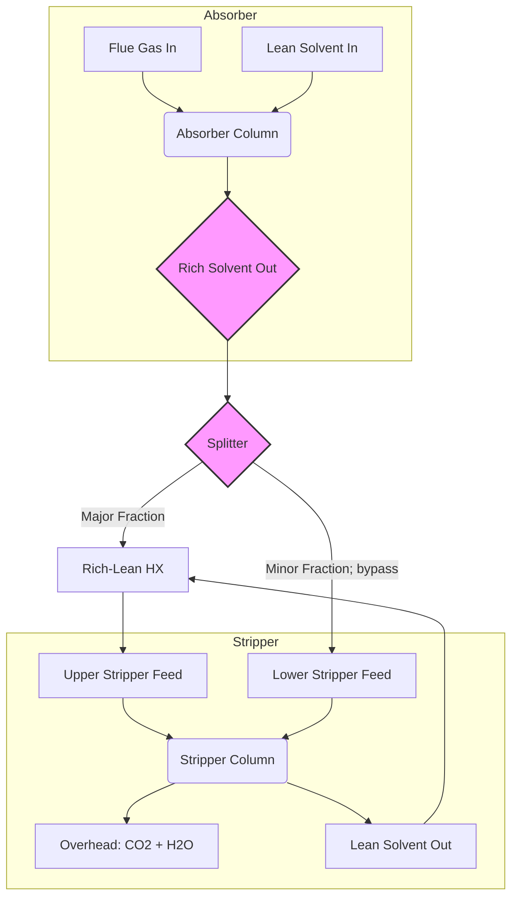

# **Optimization Framework and Methodologies for CO₂ Absorption Systems**

---
**Document ID:** RPT-CCUS-OPT-001  
**Version:** 1.0  
**Date:** October 1, 2025  
**Classification:** Internal Research Report

---

### **Table of Contents**

1.  **Systematic Optimization Approaches**
    *   1.1 Defining the Optimization Problem
    *   1.2 The Role of Process Simulation
    *   1.3 Methodologies for Multi-Variable Optimization

2.  **Heat Integration and Network Synthesis**
    *   2.1 The Rich/Lean Exchanger: A Foundational Trade-Off
    *   2.2 Pinch Analysis for Minimum Utility Targeting
    *   2.3 Heat Exchanger Network (HEN) Design and Optimization

3.  **Process Intensification Strategies**
    *   3.1 Split-Stream Configurations
    *   3.2 Lean Vapor Compression (LVC) and Advanced Stripping
    *   3.3 Absorber Inter-cooling
    *   3.4 Divided Wall Columns (DWC)

4.  **Advanced Process Control and Real-Time Optimization**
    *   4.1 From Static Design to Dynamic Operation
    *   4.2 Model Predictive Control (MPC) for Stability and Efficiency
    *   4.3 Real-Time Optimization (RTO) for Economic Performance

5.  **Uncertainty and Robust Design**
    *   5.1 The Challenge of a Single "Optimal" Point
    *   5.2 Methodologies for Robust Optimization

---

## **1. Systematic Optimization Approaches**

The high energy penalty associated with CO₂ absorption necessitates a rigorous, systematic optimization framework. Ad-hoc, single-variable adjustments are insufficient and often lead to suboptimal or even detrimental outcomes due to the tightly coupled nature of the process. A formal optimization approach provides a structured methodology to navigate the complex, multi-dimensional design space and identify configurations that achieve minimum energy consumption or cost.

### **1.1 Defining the Optimization Problem**

The first step in any systematic optimization is to precisely define the problem by establishing the objective function, decision variables, and constraints.

**Objective Function:**
The objective function, $F(x)$, is the primary metric to be minimized (or maximized). For CO₂ capture, this is typically defined in one of two ways:
*   **Thermodynamic Objective:** Minimize the **Total Equivalent Work ($W_{eq}$)**. This provides a thermodynamically consistent basis for comparing processes that use different forms of energy (thermal vs. electrical). It is calculated by converting the thermal energy input into its work potential. This is ideal for early-stage process screening and fundamental analysis.
*   **Economic Objective:** Minimize the **Total Annualized Cost (TAC)** or the **Levelized Cost of CO₂ Captured (€/tCO₂)**. This is a more comprehensive objective that includes both Operating Expenditures (OPEX), such as energy and solvent makeup costs, and Capital Expenditures (CAPEX), such as equipment costs, amortized over the plant's lifetime.

> **Key Inquiry:** *Is the goal to find the most thermodynamically efficient process or the most economically viable one?* While correlated, these are not always the same. A process with lower energy use might require exotic materials or complex equipment, driving up CAPEX and rendering it less economical than a less efficient but cheaper alternative.

**Decision Variables:**
Decision variables are the set of process parameters that can be actively manipulated to optimize the objective function. These variables span operating conditions, solvent properties, and equipment design.

**Table 1.1: Key Decision Variables in CO₂ Capture Optimization**

| Category | Decision Variable | Typical Range / Value | Impact On |
| :--- | :--- | :--- | :--- |
| **Solvent Loop** | Solvent Concentration (wt%) | 20-40% for MEA | Viscosity, heat capacity, CO₂ loading |
| | Lean Solvent CO₂ Loading (mol/mol) | 0.15 - 0.30 | Circulation rate, sensible heat duty |
| | Solvent Circulation Rate (m³/hr) | Varies | Pumping energy, column sizing, reboiler duty |
| **Absorber** | Absorber Temperature (°C) | 40 - 60 | Absorption driving force, kinetics |
| | Absorber Packing Height/Type | - | Pressure drop (blower work), mass transfer |
| **Stripper** | Stripper Pressure (bar) | 1.5 - 2.5 (or vacuum) | Regeneration temperature, CO₂ compression work |
| | Reboiler Temperature (°C) | 110 - 125 for MEA | Regeneration efficiency, solvent degradation |
| **Heat Exchange** | Rich/Lean Exchanger ΔT_min (°C) | 5 - 15 | CAPEX vs. OPEX trade-off, reboiler duty |

**Constraints:**
Constraints define the boundaries of the feasible operating region. They ensure that the optimized solution is physically realistic, safe, and meets performance targets.
*   **Performance Constraint:** CO₂ Capture Rate ≥ 90% (typical).
*   **Operational Constraint:** Maximum Reboiler Temperature ≤ 125°C (to prevent MEA degradation).
*   **Purity Constraint:** CO₂ Product Purity ≥ 99.9%.
*   **Environmental Constraint:** Amine emissions in treated flue gas below a specified limit (ppm).
*   **Physical Constraints:** Pump capacities, column flooding limits, positive temperature differences in heat exchangers.

### **1.2 The Role of Process Simulation**

Process simulation software, such as **Aspen Plus®** or **Aspen HYSYS®**, is the cornerstone of modern process optimization. These tools provide a robust environment for:
1.  **Model Development:** Building a high-fidelity, rate-based simulation of the absorption/stripping loop that accurately models the thermodynamics (e.g., electrolyte NRTL model), kinetics, and transport phenomena.
2.  **Sensitivity Analysis:** Systematically varying one or more decision variables to understand their impact on the objective function and constraints. This is crucial for identifying the most influential parameters.
3.  **Automated Optimization:** Connecting the process model to built-in or external optimization algorithms (e.g., Sequential Quadratic Programming - SQP, Genetic Algorithms) to automatically search the design space for the optimal set of decision variables.

```python
# Conceptual Python Script using Aspen Plus COM Interface for Optimization
import aspen_plus_api

# 1. Connect to Aspen Plus Simulation
sim = aspen_plus_api.connect("CO2_Capture_Plant.bkp")

# 2. Define Objective Function and Variables
def objective_function(variables):
    lean_loading, stripper_pressure = variables
    sim.set_variable("Lean_Loading", lean_loading)
    sim.set_variable("Stripper_Pressure", stripper_pressure)
    sim.run()
    reboiler_duty = sim.get_result("Reboiler_Duty_GJ_per_ton")
    compressor_work = sim.get_result("Compressor_Work_GJ_per_ton")
    total_equivalent_work = reboiler_duty * 0.24 + compressor_work # Simplified
    return total_equivalent_work

# 3. Define Constraints
constraints = [
    {"type": "ineq", "fun": lambda vars: sim.get_result("Capture_Rate") - 0.90},
    {"type": "ineq", "fun": lambda vars: 125 - sim.get_result("Reboiler_Temp")}
]

# 4. Run Optimization
from scipy.optimize import minimize
initial_guess = [0.25, 1.8]
bounds = [(0.15, 0.35), (1.5, 2.5)]

result = minimize(objective_function, initial_guess, method='SLSQP', bounds=bounds, constraints=constraints)

print("Optimal Solution Found:")
print(f"  Lean Loading: {result.x[0]:.3f} mol/mol")
print(f"  Stripper Pressure: {result.x[1]:.2f} bar")
print(f"  Minimum Equivalent Work: {result.fun:.3f} GJ/tCO2")
```
*Note: The code above is a conceptual representation of how an optimization workflow is automated by linking a simulator to an optimization routine.*

### **1.3 Methodologies for Multi-Variable Optimization**

Given the numerous interacting variables, optimization is a non-trivial task. Common methodologies include:
*   **Parametric Sweeps (Sensitivity Analysis):** The foundational step. By varying one variable at a time while holding others constant, engineers build an intuition for the process's behavior. However, this method cannot find the true optimum in a multi-variable space due to interactions.
*   **Gradient-Based Methods (e.g., SQP):** These are efficient, derivative-based algorithms that are excellent for finding local optima in continuous, well-behaved problem spaces. They are standard in most process simulators.
*   **Stochastic/Heuristic Methods (e.g., Genetic Algorithms, Simulated Annealing):** These methods are better suited for complex, non-convex problems with the potential for many local minima. They are computationally more expensive but have a higher probability of finding the global optimum.

The typical workflow involves using parametric sweeps to define a reasonable starting point and bounds, followed by a gradient-based optimizer to quickly find a locally optimal solution.

---

## **2. Heat Integration and Network Synthesis**

With the benchmark specific reboiler duty (SRD) for MEA processes at ~4.0 GJ/tCO₂, of which a significant portion is sensible heat, internal heat recovery is the most critical lever for reducing operating costs. A systematic approach to heat integration can drastically reduce the demand for external utilities (steam and cooling water).

### **2.1 The Rich/Lean Exchanger: A Foundational Trade-Off**

The rich/lean heat exchanger is the heart of the process's thermal efficiency, recovering heat from the hot lean solvent exiting the stripper to pre-heat the cool rich solvent entering it. The key design parameter is the **minimum temperature approach (ΔT_min)**.

*   **Low ΔT_min (e.g., 5-7 °C):** Maximizes heat recovery, directly reducing the load on the reboiler and lean cooler. However, this requires a very large heat transfer area, significantly increasing the CAPEX of the exchanger.
*   **High ΔT_min (e.g., 15-20 °C):** Reduces the heat exchanger size and cost but results in poor thermal recovery, leading to higher lifetime energy consumption (OPEX).

This creates a classic **CAPEX vs. OPEX trade-off**. Analysis from techno-economic studies indicates that the optimal economic value for ΔT_min often lies in the **8-10 °C** range for conventional heat exchangers and can be as low as **4-7 °C** for high-performance plate heat exchangers (PHEs) (Source: `NM1G5`). The lean/rich heat exchanger can be one of the most expensive single units, sometimes accounting for up to **41% of the total investment cost**, underscoring the importance of this optimization (Source: `NM1G5`).

### **2.2 Pinch Analysis for Minimum Utility Targeting**

While the rich/lean exchanger is vital, a truly optimized plant considers all available heat sources and sinks. **Pinch Analysis** is a systematic methodology for determining the theoretical minimum energy requirement of a process.

1.  **Stream Data Extraction:** All process streams that require heating (cold streams, e.g., rich solvent) or cooling (hot streams, e.g., lean solvent, stripper overhead condenser) are identified with their supply/target temperatures and heat loads.
2.  **Composite Curves Construction:** The enthalpy-temperature data for all hot streams are combined into a single **Hot Composite Curve**, and similarly for cold streams into a **Cold Composite Curve**.
3.  **Pinch Point Identification:** When plotted on a T-H diagram, the point of closest vertical approach between the two curves is the **Pinch Point**. The temperature difference at this point is the bottleneck for heat integration (ΔT_min).


*Figure 2.1: A representative Temperature-Enthalpy diagram showing the Hot and Cold Composite Curves. The overlap represents the maximum possible internal heat recovery. The external heating required (Q_H,min) and cooling required (Q_C,min) are the non-overlapping portions, representing the theoretical minimum utility consumption for the given ΔT_min.*

The analysis yields three critical targets before any design is attempted:
*   **Minimum Hot Utility (Q_H,min):** The theoretical minimum amount of external heating (e.g., reboiler steam) required.
*   **Minimum Cold Utility (Q_C,min):** The theoretical minimum amount of external cooling (e.g., cooling water) required.
*   **The Pinch Temperature:** The specific temperature at which the process is "pinched."

### **2.3 Heat Exchanger Network (HEN) Design and Optimization**

With the energy targets established, a Heat Exchanger Network (HEN) is designed to achieve them. The cardinal rules of Pinch design are:
1.  Do not transfer heat across the Pinch.
2.  Do not use hot utilities below the Pinch.
3.  Do not use cold utilities above the Pinch.

Following these rules ensures the designed network meets the minimum energy target. For a CO₂ capture plant, this involves strategically matching streams. For example:
*   **Above the Pinch:** The high-temperature portion of the hot lean solvent is used to heat the high-temperature portion of the rich solvent feed. The final heating to the reboiler setpoint is done with external steam.
*   **Below the Pinch:** The cooler portion of the lean solvent is used to pre-heat the incoming cold rich solvent. The final cooling of the lean solvent is done with cooling water.

Further HEN optimization involves minimizing the number of exchanger units and the total heat transfer area to reduce CAPEX, often using a superstructure optimization approach to explore a vast array of possible network configurations. The choice of exchanger type also has a major economic impact. Replacing traditional Shell and Tube Heat Exchangers (STHX) with Gasketed-Plate Heat Exchangers (G-PHEs) can reduce capture costs by **€5-€6/tCO₂** due to their higher heat transfer coefficients and lower cost per unit area (Source: `NM1G5`).

---

## **3. Process Intensification Strategies**

Process Intensification (PI) aims to develop novel equipment and process configurations that offer drastically improved performance, smaller footprints, and lower energy consumption compared to conventional designs. Several PI strategies have proven highly effective for CO₂ absorption.

### **3.1 Split-Stream Configurations**

In a conventional flowsheet, the entire rich solvent stream is heated to the full regeneration temperature. However, not all of the CO₂ is equally difficult to strip. A split-stream design exploits this by dividing the rich solvent flow.

**Figure 3.1: Rich Solvent Split-Stream Configuration**

*Caption: In a rich-split configuration, a smaller portion of the rich solvent bypasses the main heat exchanger and enters the stripper lower down. This stream is heated directly by the stripping vapor from the reboiler. The majority of the solvent is sent to the top of the column. This allows for more efficient use of the stripping steam, as the easily removable CO₂ is stripped by cooler vapor higher up, while the more difficult-to-remove CO₂ is stripped by hotter vapor at the bottom. This can reduce the overall reboiler duty.*

Studies have identified the rich-split configuration as a highly energy-efficient process improvement (Source: `A7KWE`). Variations like the **Advanced Flash Stripper**, which uses a combination of rich solvent bypass and a flash drum, have demonstrated the potential to reduce the specific reboiler duty by **over 25%** compared to a conventional setup (Source: `A7KWE`).

### **3.2 Lean Vapor Compression (LVC) and Advanced Stripping**

Lean Vapor Compression is a process intensification strategy that integrates a flash step and vapor compression into the stripping loop.
*   **Operation:** A portion of the hot lean solvent from the stripper bottom is flashed at a lower pressure. The resulting vapor (mostly steam) is then compressed and re-injected into the stripper bottom.
*   **Benefit:** This acts as an internal heat pump. It recycles a portion of the solvent's own heat content to generate stripping steam, reducing the amount of external steam required by the main reboiler. This is distinct from MVR on the overheads, as it works on the lean solvent side.

### **3.3 Absorber Inter-cooling**

The absorption of CO₂ into amine solvents is a highly exothermic reaction, which causes the solvent temperature to rise as it flows down the absorber column. This temperature bulge reduces the solvent's carrying capacity and the driving force for mass transfer in the lower sections of the column.

**Absorber Inter-cooling** involves withdrawing the solvent at an intermediate point in the column, cooling it with an external heat exchanger, and re-injecting it back into the column.

> **Benefit:** By removing the heat of reaction, inter-cooling maintains a lower temperature profile throughout the absorber. This improves the overall mass transfer driving force, allowing for either a higher CO₂ loading for a given column height or a shorter column for a given capture rate. The result is a lower required solvent circulation rate, which directly reduces both reboiler duty (less sensible heat) and pumping energy (Source: `WVSYM`).

### **3.4 Divided Wall Columns (DWC)**

A Divided Wall Column is a single vessel containing a vertical partition that allows it to perform the function of two separate distillation columns. In the context of CO₂ capture, it can be used to integrate different stripping operations or combine stripping with other separation tasks. For example, a DWC could be configured to manage a split-flow design within a single shell, with the two sides of the partition operating under slightly different conditions.

The primary advantages of DWCs are:
*   **Reduced Capital Cost:** One column shell, one reboiler, and one condenser replace two of each.
*   **Reduced Energy Consumption:** Eliminates intermediate heating and cooling.
*   **Smaller Footprint:** A single, taller column requires less plot space than two separate columns.

DWCs represent a significant step in intensifying the separation process, offering savings in both CAPEX and OPEX (Source: `Z5I3T`, `WVSYM`).

---

## **4. Advanced Process Control and Real-Time Optimization**

The optimization strategies discussed so far focus on achieving an optimal *design* for a steady-state operating point. However, real-world power plants and industrial facilities operate under constantly varying conditions (e.g., load changes, ambient temperature swings, variations in flue gas composition). Advanced Process Control (APC) and Real-Time Optimization (RTO) are essential for maintaining peak efficiency under these dynamic conditions.

### **4.1 From Static Design to Dynamic Operation**

A plant designed to be optimal at 100% load may be highly inefficient when the host plant throttles down to 50%. A robust control strategy is needed to continuously adjust operating parameters to find the most efficient operating point for the *current* conditions. This is the domain of APC and RTO, which form a hierarchical control structure.

**Figure 4.1: Hierarchical Control and Optimization Structure**
```mermaid
graph TD
    subgraph Optimization Layer (Minutes to Hours)
        RTO[Real-Time Optimizer]
        RTO -->|Sends Optimal Setpoints| MPC
    end
    subgraph Control Layer (Seconds to Minutes)
        MPC[Model Predictive Controller]
        MPC -->|Sends Manipulated Variable moves| DCS
    end
    subgraph Base Layer (Real-Time)
        DCS[Basic Control (PID Loops)]
        DCS -->|Controls Valves, Pumps| Plant
        Plant -->|Process Variables| DCS
        DCS -->|PVs| MPC
        MPC -->|PVs| RTO
    end

    style RTO fill:#f9f,stroke:#333,stroke-width:2px
    style MPC fill:#ccf,stroke:#333,stroke-width:2px
```
*Caption: The RTO layer periodically calculates the most economically optimal setpoints based on current prices and constraints. The MPC layer uses a dynamic process model to adjust the plant controls to meet these setpoints while respecting operational limits.*

### **4.2 Model Predictive Control (MPC)**

MPC is an advanced control technique that uses an explicit, dynamic mathematical model of the process.
*   **How it Works:** At each control interval, the MPC controller uses the model to predict the future behavior of the process over a certain time horizon. It then calculates a sequence of future moves for the manipulated variables (e.g., solvent flow rate, reboiler steam flow) that will drive the controlled variables (e.g., capture rate, reboiler temperature) to their desired setpoints while honoring all constraints. Only the first move in the calculated sequence is implemented, and the entire calculation is repeated at the next interval.
*   **Benefits for CO₂ Capture:**
    *   **Constraint Handling:** MPC can explicitly handle constraints like maximum solvent temperature or column flooding limits, allowing the process to be operated closer to its true limits safely.
    *   **Feedforward Control:** It can proactively respond to measured disturbances, such as a change in the upstream power plant load (and thus flue gas flow), before they impact the capture rate.
    *   **Multi-variable Control:** It inherently handles the interactions between variables, making it superior to single-loop PID controllers for a coupled process like CO₂ absorption.

### **4.3 Real-Time Optimization (RTO)**

While MPC is focused on maintaining stable operation at a given set of targets, the RTO layer is responsible for determining what those targets should be.
*   **How it Works:** The RTO system uses a more rigorous, steady-state process model (often the same model used for design) and current economic data (e.g., cost of electricity, cost of steam, value of CO₂). Periodically (e.g., every few hours), it solves an optimization problem to find the set of operating setpoints (e.g., optimal lean loading, optimal capture rate) that minimizes the total operating cost under current conditions.
*   **Benefits for CO₂ Capture:**
    *   **Economic Optimization:** RTO shifts the control objective from purely technical targets to direct economic performance, ensuring the plant is always running at its most profitable or lowest-cost point.
    *   **Adaptability:** It allows the plant to adapt its operating strategy to changing market conditions. For example, if the price of electricity spikes, the RTO might reduce the load on energy-intensive equipment like MVR compressors, even if it means a slight increase in steam consumption.

Together, MPC and RTO provide a powerful framework for ensuring that a well-designed plant achieves its full economic and efficiency potential throughout its operational life.

---

## **5. Uncertainty and Robust Design**

The final layer of a sophisticated optimization framework is accounting for uncertainty. A design optimized for a single, deterministic set of conditions (e.g., a fixed electricity price or flue gas flow rate) may perform poorly if those conditions change. Robust design aims to produce solutions that are not necessarily "optimal" at one point but perform well over a wide range of potential scenarios.

### **5.1 The Challenge of a Single "Optimal" Point**

Design and economic parameters are not fixed values but are subject to uncertainty:
*   **Economic Uncertainty:** Future prices of electricity, steam, and carbon credits are volatile.
*   **Technical Uncertainty:** Flue gas flow rates and CO₂ concentrations vary with upstream plant load. Equipment performance (e.g., heat exchanger fouling) degrades over time.
*   **Model Uncertainty:** The process models used for simulation are themselves imperfect representations of reality.

An optimization based on single-point estimates can lead to a "brittle" design that is highly sensitive to these uncertainties.

### **5.2 Methodologies for Robust Optimization**

Instead of optimizing for a single scenario, robust optimization techniques seek to find solutions that perform well on average or have the lowest performance variability across a range of scenarios.

*   **Uncertainty Quantification (UQ):** The first step is to characterize the uncertainty. This can be done by defining probability distributions for key parameters (e.g., electricity price follows a known distribution). Monte Carlo simulation is a common technique where the process simulation is run thousands of times with inputs sampled from these distributions to understand the range of possible outcomes.
*   **Multi-Scenario Optimization:** The optimization problem is solved simultaneously for a discrete set of representative scenarios (e.g., "high electricity price," "low electricity price," "plant at 50% load"). The objective becomes minimizing the weighted-average cost across all scenarios.
*   **Flexibility Analysis (Two-Stage Stochastic Programming):** This advanced approach designs a plant with built-in flexibility. It separates decision variables into two stages:
    1.  **Design Variables:** Fixed at the design stage (e.g., column size, heat exchanger area).
    2.  **Control Variables:** Can be adjusted during operation (e.g., solvent flow rate).
    The optimization aims to find the best design that allows for operational adjustments to minimize costs, whatever uncertain scenario unfolds in the future.

By incorporating uncertainty, the final design is more resilient, ensuring that the CO₂ capture plant remains economically and technically efficient not just on paper, but throughout its multi-decade operational lifetime.