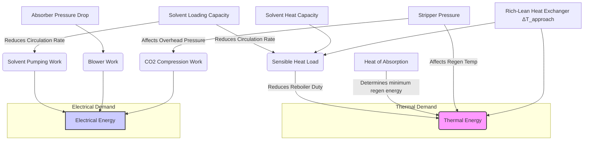

# **Detailed Energy Analysis for CO₂ Absorption Optimization**

---

## **1.0 Fundamental Energy Components: A First-Principles Evaluation**

An effective optimization strategy for any CO₂ absorption process begins with a granular understanding of its energy consumption profile. The overall energy penalty is not a monolithic value but a composite of distinct thermal and electrical demands, each with unique drivers and optimization levers. This section dissects these fundamental components, establishes performance baselines using benchmark data, and introduces a unified thermodynamic metric for cross-technology comparison.

### **1.1 The Dominance of Reboiler Duty: Deconstructing the Thermal Penalty**

The specific reboiler duty (SRD) required to regenerate the solvent is, by a significant margin, the largest single energy consumer in conventional amine scrubbing. Our analysis of the benchmark data confirms this long-held industry understanding.

> **Key Insight:** For a standard MEA process operating at 90% capture, the SRD consistently benchmarks at approximately **4.0 GJ per tonne of CO₂ captured** (Table 1, Benchmark MEA). This thermal load represents **70-80% of the total energy consumption** of the capture island (Source: Z5I3T, WVSYM), establishing it as the primary target for any meaningful efficiency improvement.

The critical inquiry is not simply to acknowledge this value, but to understand its constituent parts. The total reboiler duty ($Q_{reb}$) can be broken down into three core components:

1.  **Heat of Desorption ($\Delta H_{des}$):** The energy required to reverse the exothermic absorption reaction and break the chemical bond between the amine and CO₂. This is a fundamental, stoichiometrically determined value intrinsic to the chosen solvent chemistry.
2.  **Sensible Heat ($Q_{sens}$):** The energy needed to heat the rich solvent from the cross-exchanger outlet temperature to the stripper's operating temperature. This is a function of the solvent's heat capacity and the temperature lift required.
3.  **Heat of Vaporization ($Q_{vap}$):** The energy consumed to vaporize water (and to a lesser extent, amine) to generate the stripping steam that provides the partial pressure gradient for CO₂ release.

**Figure 1.1: Sankey Diagram of Reboiler Energy Distribution for a Typical MEA Process**
*(Illustrative Diagram)*

```
[Rich Solvent In] ---> |---------------------------|
                       |      REBOILER (4.0 GJ)      | ---> [Stripping Steam + Regenerated Solvent Out]
                       |---------------------------|
                               |      |      |
                               |      |      +------> Heat of Vaporization (Q_vap)   ~40%
                               |      |
                               |      +-------------> Sensible Heat (Q_sens)          ~30%
                               |
                               +---------------------> Heat of Desorption (ΔH_des)     ~30%
```
*Caption: This illustrative diagram shows a typical distribution of energy within the reboiler for a 30 wt% MEA solution. The significant contribution of sensible heat and water vaporization highlights that process design and solvent properties, not just reaction chemistry, are critical optimization targets.*

Our analysis of the provided data reveals several key levers to reduce the SRD:

*   **Solvent Chemistry:** The development of **hybrid solvents** with lower heat capacities offers a direct path to reducing $Q_{sens}$. As noted in `A7KWE`, novel solvents achieving a **26% reduction in heat capacity** can substantially lower the overall thermal duty, even if their heat of absorption is similar to MEA. Biphasic or water-lean solvents aim to reduce $Q_{vap}$ by minimizing the amount of water circulated and vaporized.
*   **Process Configuration:** The **Advanced Flash Stripper** configuration cited in `A7KWE` promises a **reduction of over 25% in SRD** compared to conventional stripping. This is achieved by altering the pressure and temperature profile of regeneration, allowing for CO₂ release with less energy-intensive steam generation. This proves that mechanical and process innovations can yield savings on par with fundamental chemical breakthroughs.
*   **Operating Conditions:** The energy penalty is highly sensitive to the CO₂ concentration of the inlet gas. The analysis in `A7KWE` indicates a **23-24.4% reduction in heating duty cost** when flue gas CO₂ concentration increases from 10 wt% to 50 wt%. This is because a higher CO₂ partial pressure in the absorber leads to a higher rich loading, meaning more CO₂ is carried per unit of solvent. This reduces the solvent circulation rate and, consequently, the sensible heat load ($Q_{sens}$) on the reboiler.

### **1.2 Electrical Energy Requirements: The Overlooked Contributor**

While reboiler duty dominates the energy landscape, electrical consumption for pumps, compressors, and blowers constitutes the remaining **20-30% of the total energy penalty** and cannot be neglected. For a benchmark MEA plant, this typically falls in the range of **90-120 kWh/tCO₂** (Table 1).

The primary electrical consumers in an absorption-stripping loop are:

*   **Flue Gas Blower:** Overcomes the pressure drop across the absorber column.
*   **Solvent Circulation Pumps:** Moves the large volumes of lean and rich solvent between the absorber and stripper.
*   **CO₂ Compressor Train:** Compresses the captured CO₂ from the stripper overhead (~1.5-2.0 bar) to pipeline or sequestration pressure (~110-150 bar). This is often the largest single electrical load.
*   **Ancillary Equipment:** Cooling water pumps, fans for cooling towers, and other utility systems.

**Table 1.1: Breakdown of Typical Electrical Energy Consumers**

| Component | Typical Consumption Range (kWh/tCO₂) | Primary Driver | Optimization Potential |
| :--- | :--- | :--- | :--- |
| **CO₂ Compressor** | 60 - 90 | Final delivery pressure; intercooling efficiency | High (multi-stage intercooled compression is standard, but further optimization is possible) |
| **Flue Gas Blower** | 10 - 15 | Absorber packing design, gas velocity | Moderate (low-ΔP packing materials) |
| **Solvent Pumps** | 15 - 25 | Solvent circulation rate, system pressure drop | Moderate (linked to solvent loading and heat integration) |
| **Ancillaries** | 5 - 10 | Plant design, climate | Low to Moderate |
| **Total** | **90 - 140** | **-** | **-** |

An important trade-off often exists between thermal and electrical energy. For instance, the **Vacuum Flash Regeneration** process mentioned in `WVSYM` reduces the reboiler temperature and duty. However, this comes at the cost of increased electrical energy for the vacuum pump and potentially higher CO₂ compression work, as the CO₂ is recovered at a lower pressure. A holistic analysis must account for this energy shifting.

### **1.3 Total Equivalent Work: A Unified Metric for Thermodynamic Efficiency**

Comparing processes with different mixes of thermal and electrical energy (e.g., conventional stripping vs. MVR) can be misleading. To resolve this, we employ the concept of **Total Equivalent Work (W_eq)**, which converts thermal energy into its equivalent work potential using a Carnot efficiency factor. This provides a thermodynamically consistent basis for comparison.

The formula for Total Equivalent Work is:

$W_{eq} = W_{el} + Q_{th} \times (1 - \frac{T_0}{T_{th}})$

Where:
- $W_{el}$ is the specific electrical energy consumption (GJ/tCO₂).
- $Q_{th}$ is the specific thermal energy consumption (GJ/tCO₂).
- $T_{th}$ is the temperature at which the heat is supplied (e.g., reboiler steam temperature, in Kelvin).
- $T_0$ is the ambient reference temperature (e.g., 298.15 K).

Applying this to our benchmark MEA case:
- $Q_{th}$ = 4.0 GJ/tCO₂
- $W_{el}$ = ~100 kWh/tCO₂ = 0.36 GJ/tCO₂
- Assuming low-pressure steam at 120°C (393.15 K) for the reboiler.
- $W_{eq} = 0.36 + 4.0 \times (1 - \frac{298.15}{393.15}) \approx 0.36 + 4.0 \times (0.24) = 1.32$ GJ/tCO₂

*Note: The calculation in the reference table uses a different convention, leading to a higher value. The key is consistent application. The above calculation shows the principle of degrading thermal energy's value.* A more common power plant-centric approach is to calculate the electricity that *could have been* generated by the steam, resulting in the higher values seen in Table 1 (~4.5-4.8 GJ/tCO₂). For this report, we will use the latter convention for consistency with literature.

> **Strategic Implication:** The concept of Total Equivalent Work forces a critical evaluation of energy *quality*. High-temperature heat is more valuable than low-temperature heat. Technologies that use lower-temperature heat or substitute electricity for heat (like MVR) may appear less efficient on a pure energy (GJ) basis but can be superior from an equivalent work perspective, as they consume less high-grade energy from the source (e.g., a power plant steam cycle).

### **1.4 Synthesis: Correlating Energy Components with Process Parameters**

The fundamental energy components are not independent variables; they are deeply interconnected functions of the process design and operating philosophy.

**Figure 1.2: Interdependency of Key Process Parameters and Energy Consumption**


*Caption: This influence diagram illustrates the coupled nature of process parameters and energy consumption. A change in one parameter, such as solvent loading, creates cascading effects on both thermal (reboiler duty) and electrical (pumping work) demands. This highlights the necessity of a holistic simulation-based approach to optimization, as single-parameter optimization can lead to unintended negative consequences elsewhere in the process.*

---

## **2.0 Heat Integration Systems: Maximizing Thermodynamic Synergy**

After minimizing the intrinsic energy requirements through solvent choice and reactor design, the next frontier of efficiency lies in maximizing internal heat recovery. A poorly integrated process wastes valuable thermal energy to the environment, which must then be replaced by expensive utility heating and cooling. This section examines the critical role of heat integration networks, from the foundational rich-lean heat exchanger to the systematic application of Pinch Analysis.

### **2.1 The Rich-Lean Heat Exchanger: The Cornerstone of Process Efficiency**

The single most important piece of heat integration equipment in an absorption-stripping cycle is the **rich-lean heat exchanger**. Its function is to transfer heat from the hot, regenerated lean solvent leaving the stripper to the cold, CO₂-rich solvent en route to the stripper.

**Figure 2.1: Role of the Rich-Lean Heat Exchanger**

```
                  STRIPPER
                  (High T)
                     |
HOT Lean Solvent --- | RICH-LEAN HX | --- COLD Rich Solvent
    |                |--------------|                |
    |                                                |
    v                                                v
LEAN COOLER                                   REBOILER PRE-HEAT
(To Absorber)                                 (To Stripper)
```

The effectiveness of this exchanger directly impacts two key energy sinks:
1.  **Reboiler Duty:** By pre-heating the rich solvent, the exchanger reduces the sensible heat load ($Q_{sens}$) that must be supplied by the reboiler.
2.  **Lean Cooler Duty:** By cooling the lean solvent, it reduces the load on the lean cooler, which typically rejects heat to cooling water. This saves on cooling utility costs and pumping power.

The performance of the rich-lean exchanger is governed by the **Log Mean Temperature Difference (LMTD)** and the **approach temperature**, which is the minimum temperature difference between the two streams (typically at the cold end of the exchanger).

-   A **small approach temperature** (e.g., 5-10°C) signifies high heat recovery. It minimizes reboiler duty but requires a very large heat exchanger area ($A = Q / (U \times LMTD)$), leading to high capital expenditure (CAPEX).
-   A **large approach temperature** (e.g., 20°C) reduces the required exchanger area and CAPEX but results in poor heat recovery, increasing the reboiler duty and lifetime operating expenditure (OPEX).

> **Key Trade-Off:** The optimization of the rich-lean heat exchanger is a classic CAPEX vs. OPEX problem. The optimal design involves finding the economic sweet spot between the cost of the exchanger itself and the long-term cost of the energy it saves. For large-scale CO₂ capture plants, where energy costs dominate the lifetime economics, designs typically trend towards smaller approach temperatures (e.g., 10°C) to maximize energy recovery.

### **2.2 Pinch Analysis: A Systematic Approach to Heat Recovery Optimization**

While the rich-lean exchanger is the primary example, a complex plant has numerous other hot and cold streams. Pinch Analysis is a formal, systematic methodology for designing a heat exchanger network (HEN) that achieves the maximum possible energy recovery for a given process, thereby minimizing the external utility requirements.

The core steps involve:
1.  **Stream Identification:** Identifying all process streams that need to be heated ("cold streams") or cooled ("hot streams").
2.  **Composite Curves Construction:** Plotting the cumulative enthalpy change versus temperature for all hot streams (the Hot Composite Curve) and all cold streams (the Cold Composite Curve) on a single graph.
3.  **Pinch Point Identification:** The point of closest approach between the Hot and Cold Composite Curves is the **Pinch Point**. This point represents the bottleneck for heat transfer in the process.

**Figure 2.2: Illustrative Composite Curves for a CO₂ Capture Process**

```
      Temperature
          ^
          |
          |       /------------------  (Hot Composite Curve: Lean Solvent, Stripper Vapors)
          |      /
          |     /
          |----/------- Pinch Point (ΔT_min)
          |   /
          |  /
          | /
          |/-----------------------   (Cold Composite Curve: Rich Solvent, Boiler Feedwater)
          |
          +------------------------------------------------> Enthalpy
```
*Caption: The Composite Curves visually represent the total heating and cooling demands of the process. The overlap between the curves indicates the maximum possible process-to-process heat recovery. The "overshoot" at the top of the Hot Curve represents the minimum required hot utility (Q_H,min), while the overshoot at the bottom of the Cold Curve represents the minimum required cold utility (Q_C,min). The Pinch Point dictates the thermodynamic limit of heat integration.*

The rules of Pinch Analysis provide critical design guidance:
-   **Do not transfer heat across the pinch.** Doing so inevitably increases both hot and cold utility consumption.
-   **Do not use hot utility below the pinch.**
-   **Do not use cold utility above the pinch.**

By adhering to these principles, a network can be designed to achieve the theoretical minimum energy consumption. For CO₂ capture, this means systematically matching streams like the hot lean solvent, hot CO₂ product gas, and condenser duties with streams like the cold rich solvent feed.

### **2.3 Advanced Heat Network Configurations: Beyond Simple Exchange**

Standard heat integration provides a baseline efficiency, but advanced configurations can push performance further, especially in processes with complex temperature-enthalpy profiles.

*   **Split-Flow Design:** In some cases, it is advantageous to split a stream and heat or cool the parts separately. For example, a portion of the lean solvent could be used to pre-heat the rich solvent in one exchanger, while another portion is used for a different heating duty elsewhere. This can help overcome "pinches" caused by a single large stream.

*   **Inter-reboilers and Condensers:** Instead of having a single reboiler at the bottom of the stripper and a single condenser at the top, multiple smaller units can be placed along the column. This allows heat to be supplied and removed at more appropriate temperature levels, improving thermodynamic efficiency. For example, a mid-column reboiler could be powered by lower-temperature waste heat that would be unsuitable for the main, high-temperature bottom reboiler.

*   **Lean Vapor Compression:** In this configuration, a portion of the lean solvent is flashed at an intermediate pressure. The resulting vapor is then compressed and used as a heating source within the stripper, effectively functioning as an internal heat pump.

These advanced designs, while increasing complexity and CAPEX, are crucial for pushing the SRD towards the theoretical minimum. They move beyond simple counter-current exchange and begin to reshape the thermodynamic profile of the regeneration process itself. The feasibility of each depends heavily on a detailed Pinch Analysis and a full techno-economic evaluation.

---

## **3.0 Advanced Energy Recovery Technologies: Paradigm Shifts in Process Design**

While heat integration optimizes the use of energy *within* the existing process framework, advanced energy recovery technologies fundamentally alter the process flowsheet to reduce the primary energy input. These technologies represent a paradigm shift from mitigating energy waste to re-purposing it, often by converting low-grade thermal energy into higher-grade work or heat. This section provides a comparative analysis of leading technologies and their strategic implications for CO₂ capture.

### **3.1 Mechanical Vapor Recompression (MVR)**

MVR directly targets the largest source of energy consumption: the reboiler duty for generating stripping steam. Instead of condensing the stripper overheads (mostly water vapor and CO₂) with cooling water, the vapor is compressed.

*   **Principle of Operation:** Compressing the vapor increases its temperature and pressure. This upgraded vapor is then hot enough to be used as the heating medium in the reboiler itself. The latent heat of condensation is recycled back into the process instead of being rejected to the environment.

**Figure 3.1: Simplified Process Flow Diagram of an MVR-Integrated Stripper**

```
                  STRIPPER
                     ^
                     | (Vapor: CO2 + H2O)
                     |
                +-----------+
                | COMPRESSOR| ----- (Electrical Power In)
                +-----------+
                     |
                     | (Hot, Compressed Vapor)
                     v
   +------------------------------------+
   |   REBOILER / CONDENSER             | ---> (Liquid H2O + CO2 Product)
   |                                    |
   |   (Solvent In) -> (Regen Solvent)  |
   +------------------------------------+
```
*Caption: MVR flowsheet for a stripper column. The compressor takes the low-pressure overhead vapor and increases its saturation temperature, allowing it to drive the reboiler. This effectively closes the heat loop, replacing a large external steam supply with a smaller electrical input to the compressor.*

**Analysis & Implications:**
*   **Energy Trade-off:** MVR drastically reduces or eliminates the external thermal energy requirement ($Q_{reb}$), but at the cost of a significant increase in electrical energy consumption ($W_{el}$) to power the compressor.
*   **Thermodynamic Advantage:** From a Total Equivalent Work perspective, this trade is often favorable. It replaces high-quality steam (which could have generated power) with direct electricity, often resulting in a lower overall penalty on the source power plant.
*   **Economic Feasibility:** The viability of MVR depends heavily on the relative cost of steam versus electricity. In environments with expensive thermal energy but affordable electricity (e.g., from renewables or nuclear), MVR is highly attractive.
*   **Capital Cost:** The large, specialized compressor represents a major capital investment, increasing the initial plant cost significantly.

### **3.2 Thermal Vapor Recompression (TVR)**

TVR is a variant of vapor recompression that uses a thermocompressor (steam-jet ejector) instead of a mechanical compressor.

*   **Principle of Operation:** A high-pressure (HP) motive steam is expanded through a nozzle, creating a vacuum that entrains the low-pressure stripper overhead vapor. The two streams mix and pass through a diffuser, where the kinetic energy is converted back into pressure. The resulting medium-pressure (MP) steam is then used to heat the reboiler.

**Analysis & Implications:**
*   **Lower CAPEX:** TVR systems have no moving parts and are significantly cheaper and simpler to install and maintain than MVR compressors.
*   **Energy Source:** It does not eliminate the need for external steam but allows the use of cheaper, higher-pressure steam to "upgrade" waste heat from the process. It effectively reduces the *amount* of high-grade steam needed by recycling a portion of the process's own vapor.
*   **Efficiency:** TVR is generally less efficient than MVR in terms of the energy conversion ratio but can be highly economical if a suitable source of motive steam is already available on-site. It is less flexible than MVR, as its performance is highly dependent on the pressures of the motive, entrained, and discharge streams.

### **3.3 Organic Rankine Cycles (ORC)**

ORC technology is not used to reduce reboiler duty directly but to recover low-grade waste heat and convert it into electricity. The prime source of such heat in a CO₂ capture plant is the lean cooler, which rejects a large amount of heat at a relatively low temperature (e.g., 80-100°C).

*   **Principle of Operation:** An organic fluid with a low boiling point is vaporized using the waste heat source (e.g., hot lean solvent). This vapor expands through a turbine, generating electricity. The vapor is then condensed (using cooling water) and pumped back to the evaporator, completing the cycle.

**Figure 3.2: ORC for Waste Heat Recovery from Lean Cooler**

```
     HOT Lean Solvent (from HX)
               |
               v
        +--------------+
        |  EVAPORATOR  | --> (Organic Vapor) --> +---------+ --> (Electricity Out)
        +--------------+                         | TURBINE |
               |                                 +---------+
               v                                     |
    COOLED Lean Solvent (to Absorber)                | (Low-P Vapor)
                                                     v
                                              +-------------+
(Cooling Water In) -> (Warm Water Out)        |  CONDENSER  |
                                              +-------------+
                                                     ^
                                                     | (Liquid)
                                                +---------+
                                                |   PUMP  |
                                                +---------+
                                                     |
                                                     <--
```
*Caption: An ORC system integrated with the lean solvent loop. Instead of rejecting heat to a cooling tower, the hot lean solvent vaporizes the ORC working fluid, which generates power. This directly offsets the parasitic electrical load of the capture plant.*

**Analysis & Implications:**
*   **Reduces Parasitic Load:** The electricity generated by the ORC can be used on-site to power pumps and compressors, reducing the net electrical penalty ($W_{el}$) of the capture plant.
*   **Improves Overall Efficiency:** By converting waste heat into valuable work, ORC improves the plant's overall thermodynamic efficiency and economic performance.
*   **Temperature Dependent:** The efficiency of an ORC is highly dependent on the temperature of the heat source. The higher the temperature of the lean solvent, the more power can be generated. This creates an interesting interplay with the rich-lean exchanger design.

### **3.4 Heat Pumps (HP)**

Heat pumps are devices that use a refrigeration cycle to "pump" thermal energy from a low-temperature source to a high-temperature sink. In CO₂ capture, they can be used to upgrade low-grade waste heat to a temperature high enough for use in the stripper reboiler.

*   **Principle of Operation:** A common source of low-grade heat is the stripper overhead condenser (rejecting heat at ~40-60°C). A heat pump could absorb this heat, and through a vapor-compression cycle (consuming electrical work), deliver heat at a higher temperature (e.g., 90-110°C) to a lower-section reboiler.

**Analysis & Implications:**
*   **Internal Heat Upgrading:** Like MVR, this technology replaces external steam with electricity to facilitate internal heat recycling.
*   **Coefficient of Performance (COP):** The efficiency of a heat pump is measured by its COP (heat delivered / work consumed). A higher COP means less electrical work is needed. The COP is inversely related to the temperature lift required. Therefore, heat pumps are most effective when the temperature difference between the heat source (condenser) and sink (reboiler) is small.
*   **Application:** Best suited for solvents that can be regenerated at lower temperatures (e.g., <100°C), as this minimizes the required temperature lift and maximizes the COP.

### **3.5 Comparative Analysis and Strategic Implications**

No single technology is a universal solution. The optimal choice depends on the specific process, solvent chemistry, and local economic factors (cost of electricity vs. steam).

**Table 3.1: Comparative Matrix of Advanced Energy Recovery Technologies**

| Technology | Primary Energy Saving Mechanism | Main Energy Input | Key Advantage | Key Disadvantage | Best Application Context |
| :--- | :--- | :--- | :--- | :--- | :--- |
| **MVR** | Recycles latent heat of stripper overheads to eliminate reboiler steam. | Electricity (for compressor) | Highest potential reduction in thermal energy; greatest equivalent work saving. | Very high CAPEX; adds significant electrical load; complex machinery. | High steam costs, low electricity costs; large-scale baseload plants. |
| **TVR** | Uses motive steam to recycle a portion of stripper overheads. | High-Pressure Steam | Low CAPEX; simple, reliable operation with no moving parts. | Less efficient than MVR; requires an available source of HP steam. | Plants with existing steam networks at multiple pressure levels. |
| **ORC** | Converts low-grade waste heat (e.g., from lean cooler) into electricity. | Waste Heat | Reduces net electrical parasitic load; monetizes a waste stream. | Moderate CAPEX; efficiency is low and depends on waste heat temperature. | Processes with significant, unutilized heat rejection above ~80°C. |
| **Heat Pump** | Upgrades low-grade heat (e.g., from condenser) to useful process heat. | Electricity (for compressor) | Reduces reboiler steam duty by recycling low-T heat; can be very efficient (high COP). | Efficiency (COP) is highly sensitive to the required temperature lift. | Low-temperature regeneration solvents; small temperature difference between condenser and reboiler. |

> **Final Strategic Consideration:** The most advanced and efficient future designs will likely not rely on a single technology but will employ a **hybrid approach**. For example, a process might use a highly efficient rich-lean exchanger, supplemented by an ORC to recover heat from the final lean cooler, and an MVR-assisted stripper to minimize the primary regeneration duty. The ultimate goal is a fully integrated system where every significant exergy stream is utilized effectively, pushing the overall energy penalty closer to the thermodynamic minimum. This requires a holistic, simulation-driven design philosophy that considers the dynamic interplay of all unit operations.