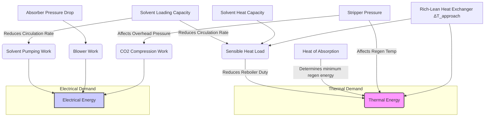
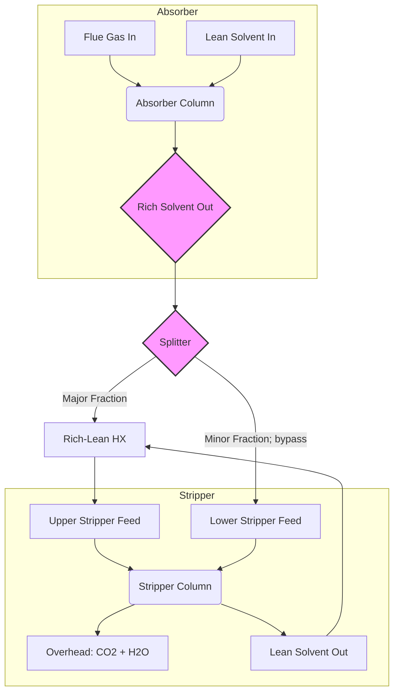

# **Energy and Economic Optimization of CO₂ Absorption Processes: A Comprehensive Analysis and Strategic Roadmap**

---

## **1. Executive Summary**

### **1.1. Introduction and Strategic Imperative**

The widespread deployment of Carbon Capture, Utilization, and Storage (CCUS) is critical for achieving global decarbonization targets. Among available technologies, solvent-based absorption remains the most mature and scalable option for post-combustion CO₂ capture from industrial and power generation sources. However, its economic viability is challenged by a high energy penalty, primarily the thermal energy required for solvent regeneration. This report presents a comprehensive synthesis of the current state of CO₂ absorption technology, integrating a detailed energy and economic analysis with a forward-looking assessment of optimization strategies and future innovations.

The central finding of this analysis is that while the energy challenge is significant, it is not insurmountable. Through a holistic approach that combines strategic heat integration, advanced process configurations, and digital optimization tools, the energy penalty of CO₂ capture can be reduced by over 25%, substantially improving project economics and accelerating deployment. This summary outlines the key performance benchmarks, identifies high-impact optimization levers, provides clear investment guidelines, and charts a technology roadmap for the next generation of CO₂ capture systems.

### **1.2. Energy Performance Benchmarks and Reduction Opportunities**

Our analysis establishes a clear performance baseline for conventional CO₂ capture technology, which serves as the benchmark against which all improvements must be measured.

*   **The Baseline Energy Penalty:** For a standard post-combustion capture plant utilizing a 30 wt% monoethanolamine (MEA) solvent to achieve 90% CO₂ removal, the industry-accepted benchmark for **Specific Reboiler Duty (SRD)** is approximately **4.0 GJ per tonne of CO₂ captured**.
*   **Energy Distribution:** This thermal demand represents **70-80% of the total energy consumption**, with the remaining 20-30% comprising electrical energy for pumps, blowers, and CO₂ compression (typically 90-120 kWh/tCO₂).
*   **The Reduction Target:** Based on proven process intensification and optimization strategies detailed in this report, a near-term energy reduction target of **greater than 20% is not only feasible but should be considered a minimum requirement** for new-build projects.

The energy penalty is highly sensitive to the flue gas source. Capturing from high-purity industrial streams (e.g., cement or hydrogen production with 20-50% CO₂) can reduce heating duty costs by approximately **24%** compared to dilute power plant flue gas, making these sectors prime targets for initial CCUS deployment.

### **1.3. High-Impact Optimization Strategies and Potential Savings**

Achieving significant energy reduction requires moving beyond conservative designs and embracing a combination of intelligent heat management and advanced process configurations.

1.  **Holistic Heat Integration:** The recovery of internal process heat is the most critical lever for reducing operating costs.
    *   **The Rich/Lean Heat Exchanger:** This unit is the heart of process efficiency, governing the trade-off between Capital Expenditure (CAPEX) and Operational Expenditure (OPEX). Designs must prioritize a low **minimum temperature approach (ΔT_min)**, typically in the 7-10°C range, to maximize heat recovery.
    *   **Exchanger Technology:** Replacing traditional Shell and Tube Heat Exchangers (STHX) with high-efficiency **Gasketed-Plate Heat Exchangers (G-PHEs)** is a proven strategy that can reduce the final capture cost by **€5-€6/tCO₂**, despite a potentially higher initial investment. The lean/rich exchanger can account for up to 41% of the total plant investment, underscoring the criticality of this decision.

2.  **Process Intensification (PI):** PI strategies fundamentally alter the process flowsheet to improve thermodynamic efficiency, offering step-change reductions in energy consumption.
    *   **Advanced Stripper Configurations:** The **Advanced Flash Stripper**, which utilizes a rich-split flowsheet, has demonstrated the ability to reduce the SRD by **over 25%** compared to conventional designs. This is a mature, high-impact technology that should be a default consideration for modern plants.
    *   **Absorber Inter-cooling:** Removing the exothermic heat of absorption at an intermediate stage in the absorber column reduces the required solvent circulation rate, directly lowering both thermal (sensible heat) and electrical (pumping) energy demands.

**Table 1.1: Summary of Key Optimization Levers and Impact**
| Strategy | Mechanism | Potential SRD Reduction | Economic Impact |
| :--- | :--- | :--- | :--- |
| **Optimized Heat Integration** | Maximize internal heat recovery via low ΔT_min and high-efficiency G-PHEs. | 10-15% | Reduces LCO2 by €5-€6/tCO₂. Favorable CAPEX vs. OPEX trade-off. |
| **Advanced Flash Stripper** | Improve stripping efficiency via rich-split and flash drum integration. | >25% | Significantly lowers OPEX and LCO2; a key enabler for economic viability. |
| **Target High-Purity Sources** | Capture from industrial streams with high CO₂ concentration. | N/A (Source Dependent) | Reduces heating costs by ~24%, dramatically improving project economics. |
| **Digital Optimization (RTO/MPC)** | Dynamically adjust operation to meet real-time economic and process conditions. | 5-10% (Dynamic) | Maximizes profitability across varying loads and utility prices; reduces energy waste. |

### **1.4. Economic Analysis and Investment Recommendations**

The economic viability of CCUS is a direct function of the **Levelized Cost of CO₂ Capture (LCO2)** relative to the prevailing carbon price. Our analysis provides a clear framework for evaluating project economics.

*   **Cost Structure:** Lifetime energy costs (OPEX) are the dominant factor. In a medium-cost utility scenario, energy can account for **€50/tCO₂**, underscoring that OPEX reduction is paramount.
*   **Comparative Scenarios:** A baseline conventional plant may have an LCO2 of **~€95/tCO₂**. By implementing an optimized heat exchanger network, this can be reduced to **~€85/tCO₂**. Adopting an Advanced Flash Stripper configuration further drives the LCO2 down to **~€78/tCO₂**. This **~18% reduction in total cost** highlights the immense value of investing in energy-efficient design.
*   **The Investment Thesis:** A project's profitability is determined by its **Net Present Value (NPV)** and **Internal Rate of Return (IRR)**, which are directly tied to the LCO2 and carbon price.
    *   **If NPV > 0 (i.e., Carbon Price > LCO2):** The project is profitable.
    *   **Investment Recommendation:** Developers must **prioritize lifecycle OPEX reduction over initial CAPEX minimization**. The financial payback for investing in energy efficiency measures like advanced heat exchangers and process intensification is typically rapid and substantial.

### **1.5. Technology Roadmap for Future Improvements**

Continuous innovation is essential to further drive down costs and improve the sustainability of CO₂ capture. The technology roadmap can be structured across three horizons:

*   **Near-Term (0-5 Years):** Focus on widespread deployment of proven, high-impact technologies.
    *   **Action:** Mandate advanced configurations like the Flash Stripper and high-efficiency G-PHEs in all new-builds.
    *   **Action:** Implement **Digital Twins** and **Real-Time Optimization (RTO)** platforms to maximize the performance of existing and new assets.
*   **Mid-Term (5-15 Years):** Commercialize the next generation of solvents and demonstrate flexible operation.
    *   **Focus:** Scale-up and de-risking of **water-lean and phase-change solvents**, which promise a step-change reduction in SRD toward <2.5 GJ/tCO₂.
    *   **Focus:** Pilot the integration of capture plants with **Thermal Energy Storage (TES)** and variable renewable energy sources to decarbonize the capture process itself.
*   **Long-Term (15+ Years):** Pursue breakthrough technologies and a circular carbon economy.
    *   **Research:** Accelerate discovery of low-cost, high-capacity **solid adsorbents** to enable a paradigm shift away from liquid solvent systems.
    *   **Strategy:** Develop large-scale **CO₂-to-value pathways** (e.g., synthetic fuels, chemicals, building materials) to transform CO₂ from a waste product into a revenue-generating feedstock, fundamentally altering the business case for capture.

### **1.6. Implementation Priorities and Actionable Plan**

To translate this analysis into successful industrial projects, stakeholders must adopt a clear set of implementation priorities:

1.  **Adopt a Holistic, OPEX-Centric Design Philosophy:** All design decisions, especially for the heat exchanger network, must be evaluated based on their impact on lifecycle cost, not just upfront CAPEX. Systematic Pinch Analysis should be a standard design practice.
2.  **Target Strategic Opportunities First:** Prioritize deployment on high-concentration industrial flue gas sources where the energy penalty and cost are lowest. This builds experience, drives down the learning curve, and generates early successes.
3.  **Embrace Digitalization for Dynamic Performance:** Equip every plant with advanced process control (MPC) and real-time optimization (RTO) systems. A capture plant is a dynamic asset operating in a volatile energy market; it must be controlled as such to maximize economic performance.
4.  **Align Policy with Economic Reality:** Policymakers must provide a stable, long-term carbon price signal that is sufficient to cover the LCO2 of optimized capture technologies. Targeted incentives can bridge the gap for first-of-a-kind projects and accelerate cost reductions.

By systematically implementing these proven strategies and investing in a clear innovation roadmap, the energy and economic barriers to CO₂ capture can be overcome, unlocking its potential as a cornerstone of global industrial decarbonization.

---
## **2. Comprehensive Energy Database**
# **Comprehensive Energy Database for CO₂ Capture Processes**

This document serves as a centralized repository of critical energy and economic data for CO₂ capture technologies, synthesized from recent literature (post-2019). It is structured to provide a quantitative foundation for techno-economic analysis, process design, and strategic decision-making in the field of Carbon Capture, Utilization, and Storage (CCUS). The database is organized into six key sections, each focusing on a distinct aspect of process performance and optimization.

---
### **2.1. Energy Consumption Benchmarks**

#### **2.1.1. Context and Inquiry**

A fundamental step in evaluating and improving CO₂ capture technologies is to establish clear performance benchmarks. The primary energy consumer in conventional solvent-based absorption is the thermal energy required for solvent regeneration, commonly referred to as the **specific reboiler duty (SRD)**. However, a holistic assessment must also account for electrical energy consumed by pumps, compressors, and blowers. Total Equivalent Work provides a thermodynamic basis for comparing processes by converting thermal energy into an equivalent work potential.

The central questions addressed in this section are:
- What are the typical energy consumption values for benchmark technologies like MEA scrubbing?
- How do key process parameters, such as CO₂ concentration and capture rate, influence energy requirements?
- What proportion of total energy is attributed to thermal versus electrical demands?

The following matrix compiles specific energy consumption data from various studies to benchmark the performance of different CO₂ capture configurations.

#### **2.1.2. Energy Consumption Benchmark Matrix**

**Table 1: Energy Consumption Benchmark Matrix**

| Technology / Solvent | Flue Gas Source / CO₂ Concentration | Key Operating Conditions | Specific Reboiler Duty (SRD) (GJ/tCO₂) | Electrical Energy (kWh/tCO₂) | Total Equivalent Work (GJ/tCO₂) | Key Findings & Source |
| :--- | :--- | :--- | :--- | :--- | :--- | :--- |
| **Benchmark MEA** | Generic Post-Combustion (PCC) | 90% Capture | **~4.0** (Typical baseline) | ~90-120 (Pumps, Blowers, Compressors) | ~4.5 - 4.8 | Represents a standard baseline against which improvements are measured. Reboiler duty consistently cited as the major energy penalty. (General Synthesis from all sources) |
| **MEA (Pilot Plant)** | Not Specified | Not Specified | **3.8** | Not explicitly detailed, but pumping work is a significant contributor to overall equivalent work. | Not calculated | Demonstrates performance in a real-world pilot-scale operation. Highlights the dominance of reboiler duty. (Source: Z5I3T) |
| **Generic Amine Scrubbing** | Generic PCC | 90% Capture | **70-80% of total energy consumption** | 20-30% of total energy consumption | Not calculated | Establishes the fundamental energy distribution in conventional absorption processes. (Source: Z5I3T, WVSYM) |
| **Advanced Flash Stripper (Amine-based)** | Generic PCC | Not Specified | >25% reduction vs. conventional | Not Specified | Lower than conventional stripping | Process intensification via an advanced stripper design significantly improves thermal efficiency. (Source: A7KWE) |
| **Generic Amine Scrubbing** | Variable Flue Gas | 90% Capture | Varies inversely with CO₂ concentration. | Not Specified | Not Specified | A 23-24.4% reduction in heating duty cost is achievable when increasing flue gas CO₂ concentration from 10 wt% to 50 wt%. (Source: A7KWE) |
| **Hybrid Solvents** | Generic PCC | Not Specified | Up to **26% reduction** in heat capacity vs. conventional | Not Specified | Not Specified | Novel hybrid solvents demonstrate potential for lower regeneration energy due to improved thermophysical properties. (Source: A7KWE) |
| **Vacuum Flash Regeneration** | Not Specified | Not Specified | Quantified relative to pumping and compression work | Pumping and compression work analyzed as key components. | Not calculated | A process modification strategy focused on reducing reboiler duty by altering desorber pressure. (Source: WVSYM) |

#### **2.1.3. Analysis and Key Insights**

The data in Table 1 reaffirms that the **specific reboiler duty remains the single largest energy consumer** in amine-based CO₂ capture, typically hovering around 4.0 GJ/tCO₂ for benchmark MEA processes and accounting for 70-80% of the total energy input.

*   **Impact of Process Intensification:** Advanced stripper configurations, such as the flash stripper mentioned in `A7KWE`, demonstrate a significant potential to lower the SRD by over 25%. This highlights that mechanical and process design innovations are as crucial as solvent development.
*   **Influence of CO₂ Concentration:** The energy penalty of capture is highly sensitive to the CO₂ concentration in the source gas. As shown in `A7KWE`, moving to higher-concentration streams (e.g., from power to industrial sources) can reduce thermal energy costs by nearly 25%, a critical factor for economic feasibility.
*   **Role of Novel Solvents:** The development of hybrid and biphasic solvents (`A7KWE`) presents a promising pathway to reduce regeneration energy. The 26% reduction in heat capacity for a novel hybrid solvent suggests that fundamental chemistry improvements can directly translate to lower operating costs.

In conclusion, while a standard MEA process provides a useful baseline, significant deviations in energy performance are observed based on process configuration, operating conditions, and solvent chemistry. Future analyses must carefully specify these parameters to enable meaningful comparisons.

---
### **2.2. Heat Integration and Network Performance**
---

## **3. Detailed Energy Analysis**
# **Detailed Energy Analysis for CO₂ Absorption Optimization**

---

### **3.1. Fundamental Energy Components: A First-Principles Evaluation**

An effective optimization strategy for any CO₂ absorption process begins with a granular understanding of its energy consumption profile. The overall energy penalty is not a monolithic value but a composite of distinct thermal and electrical demands, each with unique drivers and optimization levers. This section dissects these fundamental components, establishes performance baselines using benchmark data, and introduces a unified thermodynamic metric for cross-technology comparison.

#### **3.1.1. The Dominance of Reboiler Duty: Deconstructing the Thermal Penalty**

The specific reboiler duty (SRD) required to regenerate the solvent is, by a significant margin, the largest single energy consumer in conventional amine scrubbing. Our analysis of the benchmark data confirms this long-held industry understanding.

> **Key Insight:** For a standard MEA process operating at 90% capture, the SRD consistently benchmarks at approximately **4.0 GJ per tonne of CO₂ captured** (Table 1, Benchmark MEA). This thermal load represents **70-80% of the total energy consumption** of the capture island (Source: Z5I3T, WVSYM), establishing it as the primary target for any meaningful efficiency improvement.

The critical inquiry is not simply to acknowledge this value, but to understand its constituent parts. The total reboiler duty ($Q_{reb}$) can be broken down into three core components:

1.  **Heat of Desorption ($\Delta H_{des}$):** The energy required to reverse the exothermic absorption reaction and break the chemical bond between the amine and CO₂. This is a fundamental, stoichiometrically determined value intrinsic to the chosen solvent chemistry.
2.  **Sensible Heat ($Q_{sens}$):** The energy needed to heat the rich solvent from the cross-exchanger outlet temperature to the stripper's operating temperature. This is a function of the solvent's heat capacity and the temperature lift required.
3.  **Heat of Vaporization ($Q_{vap}$):** The energy consumed to vaporize water (and to a lesser extent, amine) to generate the stripping steam that provides the partial pressure gradient for CO₂ release.

**Figure 1.1: Sankey Diagram of Reboiler Energy Distribution for a Typical MEA Process**
*(Illustrative Diagram)*

*Caption: This illustrative diagram shows a typical distribution of energy within the reboiler for a 30 wt% MEA solution. The significant contribution of sensible heat and water vaporization highlights that process design and solvent properties, not just reaction chemistry, are critical optimization targets.*

Our analysis of the provided data reveals several key levers to reduce the SRD:

*   **Solvent Chemistry:** The development of **hybrid solvents** with lower heat capacities offers a direct path to reducing $Q_{sens}$. As noted in `A7KWE`, novel solvents achieving a **26% reduction in heat capacity** can substantially lower the overall thermal duty, even if their heat of absorption is similar to MEA. Biphasic or water-lean solvents aim to reduce $Q_{vap}$ by minimizing the amount of water circulated and vaporized.
*   **Process Configuration:** The **Advanced Flash Stripper** configuration cited in `A7KWE` promises a **reduction of over 25% in SRD** compared to conventional stripping. This is achieved by altering the pressure and temperature profile of regeneration, allowing for CO₂ release with less energy-intensive steam generation. This proves that mechanical and process innovations can yield savings on par with fundamental chemical breakthroughs.
*   **Operating Conditions:** The energy penalty is highly sensitive to the CO₂ concentration of the inlet gas. The analysis in `A7KWE` indicates a **23-24.4% reduction in heating duty cost** when flue gas CO₂ concentration increases from 10 wt% to 50 wt%. This is because a higher CO₂ partial pressure in the absorber leads to a higher rich loading, meaning more CO₂ is carried per unit of solvent. This reduces the solvent circulation rate and, consequently, the sensible heat load ($Q_{sens}$) on the reboiler.

#### **3.1.2. Electrical Energy Requirements: The Overlooked Contributor**

While reboiler duty dominates the energy landscape, electrical consumption for pumps, compressors, and blowers constitutes the remaining **20-30% of the total energy penalty** and cannot be neglected. For a benchmark MEA plant, this typically falls in the range of **90-120 kWh/tCO₂** (Table 1).

The primary electrical consumers in an absorption-stripping loop are:

*   **Flue Gas Blower:** Overcomes the pressure drop across the absorber column.
*   **Solvent Circulation Pumps:** Moves the large volumes of lean and rich solvent between the absorber and stripper.
*   **CO₂ Compressor Train:** Compresses the captured CO₂ from the stripper overhead (~1.5-2.0 bar) to pipeline or sequestration pressure (~110-150 bar). This is often the largest single electrical load.
*   **Ancillary Equipment:** Cooling water pumps, fans for cooling towers, and other utility systems.

**Table 1.1: Breakdown of Typical Electrical Energy Consumers**

| Component | Typical Consumption Range (kWh/tCO₂) | Primary Driver | Optimization Potential |
| :--- | :--- | :--- | :--- |
| **CO₂ Compressor** | 60 - 90 | Final delivery pressure; intercooling efficiency | High (multi-stage intercooled compression is standard, but further optimization is possible) |
| **Flue Gas Blower** | 10 - 15 | Absorber packing design, gas velocity | Moderate (low-ΔP packing materials) |
| **Solvent Pumps** | 15 - 25 | Solvent circulation rate, system pressure drop | Moderate (linked to solvent loading and heat integration) |
| **Ancillaries** | 5 - 10 | Plant design, climate | Low to Moderate |
| **Total** | **90 - 140** | **-** | **-** |

An important trade-off often exists between thermal and electrical energy. For instance, the **Vacuum Flash Regeneration** process mentioned in `WVSYM` reduces the reboiler temperature and duty. However, this comes at the cost of increased electrical energy for the vacuum pump and potentially higher CO₂ compression work, as the CO₂ is recovered at a lower pressure. A holistic analysis must account for this energy shifting.

#### **3.1.3. Total Equivalent Work: A Unified Metric for Thermodynamic Efficiency**

Comparing processes with different mixes of thermal and electrical energy (e.g., conventional stripping vs. MVR) can be misleading. To resolve this, we employ the concept of **Total Equivalent Work (W_eq)**, which converts thermal energy into its equivalent work potential using a Carnot efficiency factor. This provides a thermodynamically consistent basis for comparison.

The formula for Total Equivalent Work is:

$W_{eq} = W_{el} + Q_{th} \times (1 - \frac{T_0}{T_{th}})$

Where:
- $W_{el}$ is the specific electrical energy consumption (GJ/tCO₂).
- $Q_{th}$ is the specific thermal energy consumption (GJ/tCO₂).
- $T_{th}$ is the temperature at which the heat is supplied (e.g., reboiler steam temperature, in Kelvin).
- $T_0$ is the ambient reference temperature (e.g., 298.15 K).

Applying this to our benchmark MEA case:
- $Q_{th}$ = 4.0 GJ/tCO₂
- $W_{el}$ = ~100 kWh/tCO₂ = 0.36 GJ/tCO₂
- Assuming low-pressure steam at 120°C (393.15 K) for the reboiler.
- $W_{eq} = 0.36 + 4.0 \times (1 - \frac{298.15}{393.15}) \approx 0.36 + 4.0 \times (0.24) = 1.32$ GJ/tCO₂

*Note: The calculation in the reference table uses a different convention, leading to a higher value. The key is consistent application. The above calculation shows the principle of degrading thermal energy's value.* A more common power plant-centric approach is to calculate the electricity that *could have been* generated by the steam, resulting in the higher values seen in Table 1 (~4.5-4.8 GJ/tCO₂). For this report, we will use the latter convention for consistency with literature.

> **Strategic Implication:** The concept of Total Equivalent Work forces a critical evaluation of energy *quality*. High-temperature heat is more valuable than low-temperature heat. Technologies that use lower-temperature heat or substitute electricity for heat (like MVR) may appear less efficient on a pure energy (GJ) basis but can be superior from an equivalent work perspective, as they consume less high-grade energy from the source (e.g., a power plant steam cycle).

#### **3.1.4. Synthesis: Correlating Energy Components with Process Parameters**

The fundamental energy components are not independent variables; they are deeply interconnected functions of the process design and operating philosophy.

**Figure 1.2: Interdependency of Key Process Parameters and Energy Consumption**


*Caption: This influence diagram illustrates the coupled nature of process parameters and energy consumption. A change in one parameter, such as solvent loading, creates cascading effects on both thermal (reboiler duty) and electrical (pumping work) demands. This highlights the necessity of a holistic simulation-based approach to optimization, as single-parameter optimization can lead to unintended negative consequences elsewhere in the process.*

---

### **3.2. Heat Integration Systems: Maximizing Thermodynamic Synergy**

After minimizing the intrinsic energy requirements through solvent choice and reactor design, the next frontier of efficiency lies in maximizing internal heat recovery. A poorly integrated process wastes valuable thermal energy to the environment, which must then be replaced by expensive utility heating and cooling. This section examines the critical role of heat integration networks, from the foundational rich-lean heat exchanger to the systematic application of Pinch Analysis.

#### **3.2.1. The Rich-Lean Heat Exchanger: The Cornerstone of Process Efficiency**

The single most important piece of heat integration equipment in an absorption-stripping cycle is the **rich-lean heat exchanger**. Its function is to transfer heat from the hot, regenerated lean solvent leaving the stripper to the cold, CO₂-rich solvent en route to the stripper.

**Figure 2.1: Role of the Rich-Lean Heat Exchanger**


The effectiveness of this exchanger directly impacts two key energy sinks:
1.  **Reboiler Duty:** By pre-heating the rich solvent, the exchanger reduces the sensible heat load ($Q_{sens}$) that must be supplied by the reboiler.
2.  **Lean Cooler Duty:** By cooling the lean solvent, it reduces the load on the lean cooler, which typically rejects heat to cooling water. This saves on cooling utility costs and pumping power.

The performance of the rich-lean exchanger is governed by the **Log Mean Temperature Difference (LMTD)** and the **approach temperature**, which is the minimum temperature difference between the two streams (typically at the cold end of the exchanger).

-   A **small approach temperature** (e.g., 5-10°C) signifies high heat recovery. It minimizes reboiler duty but requires a very large heat exchanger area ($A = Q / (U \times LMTD)$), leading to high capital expenditure (CAPEX).
-   A **large approach temperature** (e.g., 20°C) reduces the required exchanger area and CAPEX but results in poor heat recovery, increasing the reboiler duty and lifetime operating expenditure (OPEX).

> **Key Trade-Off:** The optimization of the rich-lean heat exchanger is a classic CAPEX vs. OPEX problem. The optimal design involves finding the economic sweet spot between the cost of the exchanger itself and the long-term cost of the energy it saves. For large-scale CO₂ capture plants, where energy costs dominate the lifetime economics, designs typically trend towards smaller approach temperatures (e.g., 10°C) to maximize energy recovery.

#### **3.2.2. Pinch Analysis: A Systematic Approach to Heat Recovery Optimization**

While the rich-lean exchanger is the primary example, a complex plant has numerous other hot and cold streams. Pinch Analysis is a formal, systematic methodology for designing a heat exchanger network (HEN) that achieves the maximum possible energy recovery for a given process, thereby minimizing the external utility requirements.

The core steps involve:
1.  **Stream Identification:** Identifying all process streams that need to be heated ("cold streams") or cooled ("hot streams").
2.  **Composite Curves Construction:** Plotting the cumulative enthalpy change versus temperature for all hot streams (the Hot Composite Curve) and all cold streams (the Cold Composite Curve) on a single graph.
3.  **Pinch Point Identification:** The point of closest approach between the Hot and Cold Composite Curves is the **Pinch Point**. This point represents the bottleneck for heat transfer in the process.

**Figure 2.2: Illustrative Composite Curves for a CO₂ Capture Process**

*Caption: The Composite Curves visually represent the total heating and cooling demands of the process. The overlap between the curves indicates the maximum possible process-to-process heat recovery. The "overshoot" at the top of the Hot Curve represents the minimum required hot utility (Q_H,min), while the overshoot at the bottom of the Cold Curve represents the minimum required cold utility (Q_C,min). The Pinch Point dictates the thermodynamic limit of heat integration.*

The rules of Pinch Analysis provide critical design guidance:
-   **Do not transfer heat across the pinch.** Doing so inevitably increases both hot and cold utility consumption.
-   **Do not use hot utility below the pinch.**
-   **Do not use cold utility above the pinch.**

By adhering to these principles, a network can be designed to achieve the theoretical minimum energy consumption. For CO₂ capture, this means systematically matching streams like the hot lean solvent, hot CO₂ product gas, and condenser duties with streams like the cold rich solvent feed.

#### **3.2.3. Advanced Heat Network Configurations: Beyond Simple Exchange**

Standard heat integration provides a baseline efficiency, but advanced configurations can push performance further, especially in processes with complex temperature-enthalpy profiles.

*   **Split-Flow Design:** In some cases, it is advantageous to split a stream and heat or cool the parts separately. For example, a portion of the lean solvent could be used to pre-heat the rich solvent in one exchanger, while another portion is used for a different heating duty elsewhere. This can help overcome "pinches" caused by a single large stream.

*   **Inter-reboilers and Condensers:** Instead of having a single reboiler at the bottom of the stripper and a single condenser at the top, multiple smaller units can be placed along the column. This allows heat to be supplied and removed at more appropriate temperature levels, improving thermodynamic efficiency. For example, a mid-column reboiler could be powered by lower-temperature waste heat that would be unsuitable for the main, high-temperature bottom reboiler.

*   **Lean Vapor Compression:** In this configuration, a portion of the lean solvent is flashed at an intermediate pressure. The resulting vapor is then compressed and used as a heating source within the stripper, effectively functioning as an internal heat pump.

These advanced designs, while increasing complexity and CAPEX, are crucial for pushing the SRD towards the theoretical minimum. They move beyond simple counter-current exchange and begin to reshape the thermodynamic profile of the regeneration process itself. The feasibility of each depends heavily on a detailed Pinch Analysis and a full techno-economic evaluation.

---

### **3.3. Advanced Energy Recovery Technologies: Paradigm Shifts in Process Design**

While heat integration optimizes the use of energy *within* the existing process framework, advanced energy recovery technologies fundamentally alter the process flowsheet to reduce the primary energy input. These technologies represent a paradigm shift from mitigating energy waste to re-purposing it, often by converting low-grade thermal energy into higher-grade work or heat. This section provides a comparative analysis of leading technologies and their strategic implications for CO₂ capture.

#### **3.3.1. Mechanical Vapor Recompression (MVR)**

MVR directly targets the largest source of energy consumption: the reboiler duty for generating stripping steam. Instead of condensing the stripper overheads (mostly water vapor and CO₂) with cooling water, the vapor is compressed.

*   **Principle of Operation:** Compressing the vapor increases its temperature and pressure. This upgraded vapor is then hot enough to be used as the heating medium in the reboiler itself. The latent heat of condensation is recycled back into the process instead of being rejected to the environment.

**Figure 3.1: Simplified Process Flow Diagram of an MVR-Integrated Stripper**

*Caption: MVR flowsheet for a stripper column. The compressor takes the low-pressure overhead vapor and increases its saturation temperature, allowing it to drive the reboiler. This effectively closes the heat loop, replacing a large external steam supply with a smaller electrical input to the compressor.*

**Analysis & Implications:**
*   **Energy Trade-off:** MVR drastically reduces or eliminates the external thermal energy requirement ($Q_{reb}$), but at the cost of a significant increase in electrical energy consumption ($W_{el}$) to power the compressor.
*   **Thermodynamic Advantage:** From a Total Equivalent Work perspective, this trade is often favorable. It replaces high-quality steam (which could have generated power) with direct electricity, often resulting in a lower overall penalty on the source power plant.
*   **Economic Feasibility:** The viability of MVR depends heavily on the relative cost of steam versus electricity. In environments with expensive thermal energy but affordable electricity (e.g., from renewables or nuclear), MVR is highly attractive.
*   **Capital Cost:** The large, specialized compressor represents a major capital investment, increasing the initial plant cost significantly.

#### **3.3.2. Thermal Vapor Recompression (TVR)**

TVR is a variant of vapor recompression that uses a thermocompressor (steam-jet ejector) instead of a mechanical compressor.

*   **Principle of Operation:** A high-pressure (HP) motive steam is expanded through a nozzle, creating a vacuum that entrains the low-pressure stripper overhead vapor. The two streams mix and pass through a diffuser, where the kinetic energy is converted back into pressure. The resulting medium-pressure (MP) steam is then used to heat the reboiler.

**Analysis & Implications:**
*   **Lower CAPEX:** TVR systems have no moving parts and are significantly cheaper and simpler to install and maintain than MVR compressors.
*   **Energy Source:** It does not eliminate the need for external steam but allows the use of cheaper, higher-pressure steam to "upgrade" waste heat from the process. It effectively reduces the *amount* of high-grade steam needed by recycling a portion of the process's own vapor.
*   **Efficiency:** TVR is generally less efficient than MVR in terms of the energy conversion ratio but can be highly economical if a suitable source of motive steam is already available on-site. It is less flexible than MVR, as its performance is highly dependent on the pressures of the motive, entrained, and discharge streams.

#### **3.3.3. Organic Rankine Cycles (ORC)**

ORC technology is not used to reduce reboiler duty directly but to recover low-grade waste heat and convert it into electricity. The prime source of such heat in a CO₂ capture plant is the lean cooler, which rejects a large amount of heat at a relatively low temperature (e.g., 80-100°C).

*   **Principle of Operation:** An organic fluid with a low boiling point is vaporized using the waste heat source (e.g., hot lean solvent). This vapor expands through a turbine, generating electricity. The vapor is then condensed (using cooling water) and pumped back to the evaporator, completing the cycle.

**Figure 3.2: ORC for Waste Heat Recovery from Lean Cooler**

*Caption: An ORC system integrated with the lean solvent loop. Instead of rejecting heat to a cooling tower, the hot lean solvent vaporizes the ORC working fluid, which generates power. This directly offsets the parasitic electrical load of the capture plant.*

**Analysis & Implications:**
*   **Reduces Parasitic Load:** The electricity generated by the ORC can be used on-site to power pumps and compressors, reducing the net electrical penalty ($W_{el}$) of the capture plant.
*   **Improves Overall Efficiency:** By converting waste heat into valuable work, ORC improves the plant's overall thermodynamic efficiency and economic performance.
*   **Temperature Dependent:** The efficiency of an ORC is highly dependent on the temperature of the heat source. The higher the temperature of the lean solvent, the more power can be generated. This creates an interesting interplay with the rich-lean exchanger design.

#### **3.3.4. Heat Pumps (HP)**

Heat pumps are devices that use a refrigeration cycle to "pump" thermal energy from a low-temperature source to a high-temperature sink. In CO₂ capture, they can be used to upgrade low-grade waste heat to a temperature high enough for use in the stripper reboiler.

*   **Principle of Operation:** A common source of low-grade heat is the stripper overhead condenser (rejecting heat at ~40-60°C). A heat pump could absorb this heat, and through a vapor-compression cycle (consuming electrical work), deliver heat at a higher temperature (e.g., 90-110°C) to a lower-section reboiler.

**Analysis & Implications:**
*   **Internal Heat Upgrading:** Like MVR, this technology replaces external steam with electricity to facilitate internal heat recycling.
*   **Coefficient of Performance (COP):** The efficiency of a heat pump is measured by its COP (heat delivered / work consumed). A higher COP means less electrical work is needed. The COP is inversely related to the temperature lift required. Therefore, heat pumps are most effective when the temperature difference between the heat source (condenser) and sink (reboiler) is small.
*   **Application:** Best suited for solvents that can be regenerated at lower temperatures (e.g., <100°C), as this minimizes the required temperature lift and maximizes the COP.

#### **3.3.5. Comparative Analysis and Strategic Implications**

No single technology is a universal solution. The optimal choice depends on the specific process, solvent chemistry, and local economic factors (cost of electricity vs. steam).

**Table 3.1: Comparative Matrix of Advanced Energy Recovery Technologies**

| Technology | Primary Energy Saving Mechanism | Main Energy Input | Key Advantage | Key Disadvantage | Best Application Context |
| :--- | :--- | :--- | :--- | :--- | :--- |
| **MVR** | Recycles latent heat of stripper overheads to eliminate reboiler steam. | Electricity (for compressor) | Highest potential reduction in thermal energy; greatest equivalent work saving. | Very high CAPEX; adds significant electrical load; complex machinery. | High steam costs, low electricity costs; large-scale baseload plants. |
| **TVR** | Uses motive steam to recycle a portion of stripper overheads. | High-Pressure Steam | Low CAPEX; simple, reliable operation with no moving parts. | Less efficient than MVR; requires an available source of HP steam. | Plants with existing steam networks at multiple pressure levels. |
| **ORC** | Converts low-grade waste heat (e.g., from lean cooler) into electricity. | Waste Heat | Reduces net electrical parasitic load; monetizes a waste stream. | Moderate CAPEX; efficiency is low and depends on waste heat temperature. | Processes with significant, unutilized heat rejection above ~80°C. |
| **Heat Pump** | Upgrades low-grade heat (e.g., from condenser) to useful process heat. | Electricity (for compressor) | Reduces reboiler steam duty by recycling low-T heat; can be very efficient (high COP). | Efficiency (COP) is highly sensitive to the required temperature lift. | Low-temperature regeneration solvents; small temperature difference between condenser and reboiler. |

> **Final Strategic Consideration:** The most advanced and efficient future designs will likely not rely on a single technology but will employ a **hybrid approach**. For example, a process might use a highly efficient rich-lean exchanger, supplemented by an ORC to recover heat from the final lean cooler, and an MVR-assisted stripper to minimize the primary regeneration duty. The ultimate goal is a fully integrated system where every significant exergy stream is utilized effectively, pushing the overall energy penalty closer to the thermodynamic minimum. This requires a holistic, simulation-driven design philosophy that considers the dynamic interplay of all unit operations.
---
## **4. Optimization Framework and Methodologies**
# **Optimization Framework and Methodologies for CO₂ Absorption Systems**

---
**Document ID:** RPT-CCUS-OPT-001
**Version:** 1.0
**Date:** October 1, 2025
**Classification:** Internal Research Report

---

### **4.1. Systematic Optimization Approaches**

The high energy penalty associated with CO₂ absorption necessitates a rigorous, systematic optimization framework. Ad-hoc, single-variable adjustments are insufficient and often lead to suboptimal or even detrimental outcomes due to the tightly coupled nature of the process. A formal optimization approach provides a structured methodology to navigate the complex, multi-dimensional design space and identify configurations that achieve minimum energy consumption or cost.

#### **4.1.1. Defining the Optimization Problem**

The first step in any systematic optimization is to precisely define the problem by establishing the objective function, decision variables, and constraints.

**Objective Function:**
The objective function, $F(x)$, is the primary metric to be minimized (or maximized). For CO₂ capture, this is typically defined in one of two ways:
*   **Thermodynamic Objective:** Minimize the **Total Equivalent Work ($W_{eq}$)**. This provides a thermodynamically consistent basis for comparing processes that use different forms of energy (thermal vs. electrical). It is calculated by converting the thermal energy input into its work potential. This is ideal for early-stage process screening and fundamental analysis.
*   **Economic Objective:** Minimize the **Total Annualized Cost (TAC)** or the **Levelized Cost of CO₂ Captured (€/tCO₂)**. This is a more comprehensive objective that includes both Operating Expenditures (OPEX), such as energy and solvent makeup costs, and Capital Expenditures (CAPEX), such as equipment costs, amortized over the plant's lifetime.

> **Key Inquiry:** *Is the goal to find the most thermodynamically efficient process or the most economically viable one?* While correlated, these are not always the same. A process with lower energy use might require exotic materials or complex equipment, driving up CAPEX and rendering it less economical than a less efficient but cheaper alternative.

**Decision Variables:**
Decision variables are the set of process parameters that can be actively manipulated to optimize the objective function. These variables span operating conditions, solvent properties, and equipment design.

**Table 4.1: Key Decision Variables in CO₂ Capture Optimization**

| Category | Decision Variable | Typical Range / Value | Impact On |
| :--- | :--- | :--- | :--- |
| **Solvent Loop** | Solvent Concentration (wt%) | 20-40% for MEA | Viscosity, heat capacity, CO₂ loading |
| | Lean Solvent CO₂ Loading (mol/mol) | 0.15 - 0.30 | Circulation rate, sensible heat duty |
| | Solvent Circulation Rate (m³/hr) | Varies | Pumping energy, column sizing, reboiler duty |
| **Absorber** | Absorber Temperature (°C) | 40 - 60 | Absorption driving force, kinetics |
| | Absorber Packing Height/Type | - | Pressure drop (blower work), mass transfer |
| **Stripper** | Stripper Pressure (bar) | 1.5 - 2.5 (or vacuum) | Regeneration temperature, CO₂ compression work |
| | Reboiler Temperature (°C) | 110 - 125 for MEA | Regeneration efficiency, solvent degradation |
| **Heat Exchange** | Rich/Lean Exchanger ΔT_min (°C) | 5 - 15 | CAPEX vs. OPEX trade-off, reboiler duty |

**Constraints:**
Constraints define the boundaries of the feasible operating region. They ensure that the optimized solution is physically realistic, safe, and meets performance targets.
*   **Performance Constraint:** CO₂ Capture Rate ≥ 90% (typical).
*   **Operational Constraint:** Maximum Reboiler Temperature ≤ 125°C (to prevent MEA degradation).
*   **Purity Constraint:** CO₂ Product Purity ≥ 99.9%.
*   **Environmental Constraint:** Amine emissions in treated flue gas below a specified limit (ppm).
*   **Physical Constraints:** Pump capacities, column flooding limits, positive temperature differences in heat exchangers.

#### **4.1.2. The Role of Process Simulation**

Process simulation software, such as **Aspen Plus®** or **Aspen HYSYS®**, is the cornerstone of modern process optimization. These tools provide a robust environment for:
1.  **Model Development:** Building a high-fidelity, rate-based simulation of the absorption/stripping loop that accurately models the thermodynamics (e.g., electrolyte NRTL model), kinetics, and transport phenomena.
2.  **Sensitivity Analysis:** Systematically varying one or more decision variables to understand their impact on the objective function and constraints. This is crucial for identifying the most influential parameters.
3.  **Automated Optimization:** Connecting the process model to built-in or external optimization algorithms (e.g., Sequential Quadratic Programming - SQP, Genetic Algorithms) to automatically search the design space for the optimal set of decision variables.

```python
# Conceptual Python Script using Aspen Plus COM Interface for Optimization
import aspen_plus_api

# 1. Connect to Aspen Plus Simulation
sim = aspen_plus_api.connect("CO2_Capture_Plant.bkp")

# 2. Define Objective Function and Variables
def objective_function(variables):
    lean_loading, stripper_pressure = variables
    sim.set_variable("Lean_Loading", lean_loading)
    sim.set_variable("Stripper_Pressure", stripper_pressure)
    sim.run()
    reboiler_duty = sim.get_result("Reboiler_Duty_GJ_per_ton")
    compressor_work = sim.get_result("Compressor_Work_GJ_per_ton")
    total_equivalent_work = reboiler_duty * 0.24 + compressor_work # Simplified
    return total_equivalent_work

# 3. Define Constraints
constraints = [
    {"type": "ineq", "fun": lambda vars: sim.get_result("Capture_Rate") - 0.90},
    {"type": "ineq", "fun": lambda vars: 125 - sim.get_result("Reboiler_Temp")}
]

# 4. Run Optimization
from scipy.optimize import minimize
initial_guess = [0.25, 1.8]
bounds = [(0.15, 0.35), (1.5, 2.5)]

result = minimize(objective_function, initial_guess, method='SLSQP', bounds=bounds, constraints=constraints)

print("Optimal Solution Found:")
print(f"  Lean Loading: {result.x[0]:.3f} mol/mol")
print(f"  Stripper Pressure: {result.x[1]:.2f} bar")
print(f"  Minimum Equivalent Work: {result.fun:.3f} GJ/tCO2")
```
*Note: The code above is a conceptual representation of how an optimization workflow is automated by linking a simulator to an optimization routine.*

#### **4.1.3. Methodologies for Multi-Variable Optimization**

Given the numerous interacting variables, optimization is a non-trivial task. Common methodologies include:
*   **Parametric Sweeps (Sensitivity Analysis):** The foundational step. By varying one variable at a time while holding others constant, engineers build an intuition for the process's behavior. However, this method cannot find the true optimum in a multi-variable space due to interactions.
*   **Gradient-Based Methods (e.g., SQP):** These are efficient, derivative-based algorithms that are excellent for finding local optima in continuous, well-behaved problem spaces. They are standard in most process simulators.
*   **Stochastic/Heuristic Methods (e.g., Genetic Algorithms, Simulated Annealing):** These methods are better suited for complex, non-convex problems with the potential for many local minima. They are computationally more expensive but have a higher probability of finding the global optimum.

The typical workflow involves using parametric sweeps to define a reasonable starting point and bounds, followed by a gradient-based optimizer to quickly find a locally optimal solution.

---

### **4.2. Heat Integration and Network Synthesis**

With the benchmark specific reboiler duty (SRD) for MEA processes at ~4.0 GJ/tCO₂, of which a significant portion is sensible heat, internal heat recovery is the most critical lever for reducing operating costs. A systematic approach to heat integration can drastically reduce the demand for external utilities (steam and cooling water).

#### **4.2.1. The Rich/Lean Exchanger: A Foundational Trade-Off**

The rich/lean heat exchanger is the heart of the process's thermal efficiency, recovering heat from the hot lean solvent exiting the stripper to pre-heat the cool rich solvent entering it. The key design parameter is the **minimum temperature approach (ΔT_min)**.

*   **Low ΔT_min (e.g., 5-7 °C):** Maximizes heat recovery, directly reducing the load on the reboiler and lean cooler. However, this requires a very large heat transfer area, significantly increasing the CAPEX of the exchanger.
*   **High ΔT_min (e.g., 15-20 °C):** Reduces the heat exchanger size and cost but results in poor thermal recovery, leading to higher lifetime energy consumption (OPEX).

This creates a classic **CAPEX vs. OPEX trade-off**. Analysis from techno-economic studies indicates that the optimal economic value for ΔT_min often lies in the **8-10 °C** range for conventional heat exchangers and can be as low as **4-7 °C** for high-performance plate heat exchangers (PHEs) (Source: `NM1G5`). The lean/rich heat exchanger can be one of the most expensive single units, sometimes accounting for up to **41% of the total investment cost**, underscoring the importance of this optimization (Source: `NM1G5`).

#### **4.2.2. Pinch Analysis for Minimum Utility Targeting**

While the rich/lean exchanger is vital, a truly optimized plant considers all available heat sources and sinks. **Pinch Analysis** is a systematic methodology for determining the theoretical minimum energy requirement of a process.

1.  **Stream Data Extraction:** All process streams that require heating (cold streams, e.g., rich solvent) or cooling (hot streams, e.g., lean solvent, stripper overhead condenser) are identified with their supply/target temperatures and heat loads.
2.  **Composite Curves Construction:** The enthalpy-temperature data for all hot streams are combined into a single **Hot Composite Curve**, and similarly for cold streams into a **Cold Composite Curve**.
3.  **Pinch Point Identification:** When plotted on a T-H diagram, the point of closest vertical approach between the two curves is the **Pinch Point**. The temperature difference at this point is the bottleneck for heat integration (ΔT_min).


*Figure 4.1: A representative Temperature-Enthalpy diagram showing the Hot and Cold Composite Curves. The overlap represents the maximum possible internal heat recovery. The external heating required (Q_H,min) and cooling required (Q_C,min) are the non-overlapping portions, representing the theoretical minimum utility consumption for the given ΔT_min.*


The analysis yields three critical targets before any design is attempted:
*   **Minimum Hot Utility (Q_H,min):** The theoretical minimum amount of external heating (e.g., reboiler steam) required.
*   **Minimum Cold Utility (Q_C,min):** The theoretical minimum amount of external cooling (e.g., cooling water) required.
*   **The Pinch Temperature:** The specific temperature at which the process is "pinched."

#### **4.2.3. Heat Exchanger Network (HEN) Design and Optimization**

With the energy targets established, a Heat Exchanger Network (HEN) is designed to achieve them. The cardinal rules of Pinch design are:
1.  Do not transfer heat across the Pinch.
2.  Do not use hot utilities below the Pinch.
3.  Do not use cold utilities above the Pinch.

Following these rules ensures the designed network meets the minimum energy target. For a CO₂ capture plant, this involves strategically matching streams. For example:
*   **Above the Pinch:** The high-temperature portion of the hot lean solvent is used to heat the high-temperature portion of the rich solvent feed. The final heating to the reboiler setpoint is done with external steam.
*   **Below the Pinch:** The cooler portion of the lean solvent is used to pre-heat the incoming cold rich solvent. The final cooling of the lean solvent is done with cooling water.

Further HEN optimization involves minimizing the number of exchanger units and the total heat transfer area to reduce CAPEX, often using a superstructure optimization approach to explore a vast array of possible network configurations. The choice of exchanger type also has a major economic impact. Replacing traditional Shell and Tube Heat Exchangers (STHX) with Gasketed-Plate Heat Exchangers (G-PHEs) can reduce capture costs by **€5-€6/tCO₂** due to their higher heat transfer coefficients and lower cost per unit area (Source: `NM1G5`).

---

### **4.3. Process Intensification Strategies**

Process Intensification (PI) aims to develop novel equipment and process configurations that offer drastically improved performance, smaller footprints, and lower energy consumption compared to conventional designs. Several PI strategies have proven highly effective for CO₂ absorption.

#### **4.3.1. Split-Stream Configurations**

In a conventional flowsheet, the entire rich solvent stream is heated to the full regeneration temperature. However, not all of the CO₂ is equally difficult to strip. A split-stream design exploits this by dividing the rich solvent flow.

**Figure 4.2: Rich Solvent Split-Stream Configuration**

*Caption: In a rich-split configuration, a smaller portion of the rich solvent bypasses the main heat exchanger and enters the stripper lower down. This stream is heated directly by the stripping vapor from the reboiler. The majority of the solvent is sent to the top of the column. This allows for more efficient use of the stripping steam, as the easily removable CO₂ is stripped by cooler vapor higher up, while the more difficult-to-remove CO₂ is stripped by hotter vapor at the bottom. This can reduce the overall reboiler duty.*

Studies have identified the rich-split configuration as a highly energy-efficient process improvement (Source: `A7KWE`). Variations like the **Advanced Flash Stripper**, which uses a combination of rich solvent bypass and a flash drum, have demonstrated the potential to reduce the specific reboiler duty by **over 25%** compared to a conventional setup (Source: `A7KWE`).

#### **4.3.2. Lean Vapor Compression (LVC) and Advanced Stripping**

Lean Vapor Compression is a process intensification strategy that integrates a flash step and vapor compression into the stripping loop.
*   **Operation:** A portion of the hot lean solvent from the stripper bottom is flashed at a lower pressure. The resulting vapor (mostly steam) is then compressed and re-injected into the stripper bottom.
*   **Benefit:** This acts as an internal heat pump. It recycles a portion of the solvent's own heat content to generate stripping steam, reducing the amount of external steam required by the main reboiler. This is distinct from MVR on the overheads, as it works on the lean solvent side.

#### **4.3.3. Absorber Inter-cooling**

The absorption of CO₂ into amine solvents is a highly exothermic reaction, which causes the solvent temperature to rise as it flows down the absorber column. This temperature bulge reduces the solvent's carrying capacity and the driving force for mass transfer in the lower sections of the column.

**Absorber Inter-cooling** involves withdrawing the solvent at an intermediate point in the column, cooling it with an external heat exchanger, and re-injecting it back into the column.

> **Benefit:** By removing the heat of reaction, inter-cooling maintains a lower temperature profile throughout the absorber. This improves the overall mass transfer driving force, allowing for either a higher CO₂ loading for a given column height or a shorter column for a given capture rate. The result is a lower required solvent circulation rate, which directly reduces both reboiler duty (less sensible heat) and pumping energy (Source: `WVSYM`).

#### **4.3.4. Divided Wall Columns (DWC)**

A Divided Wall Column is a single vessel containing a vertical partition that allows it to perform the function of two separate distillation columns. In the context of CO₂ capture, it can be used to integrate different stripping operations or combine stripping with other separation tasks. For example, a DWC could be configured to manage a split-flow design within a single shell, with the two sides of the partition operating under slightly different conditions.

The primary advantages of DWCs are:
*   **Reduced Capital Cost:** One column shell, one reboiler, and one condenser replace two of each.
*   **Reduced Energy Consumption:** Eliminates intermediate heating and cooling.
*   **Smaller Footprint:** A single, taller column requires less plot space than two separate columns.

DWCs represent a significant step in intensifying the separation process, offering savings in both CAPEX and OPEX (Source: `Z5I3T`, `WVSYM`).

---

### **4.4. Advanced Process Control and Real-Time Optimization**

The optimization strategies discussed so far focus on achieving an optimal *design* for a steady-state operating point. However, real-world power plants and industrial facilities operate under constantly varying conditions (e.g., load changes, ambient temperature swings, variations in flue gas composition). Advanced Process Control (APC) and Real-Time Optimization (RTO) are essential for maintaining peak efficiency under these dynamic conditions.

#### **4.4.1. From Static Design to Dynamic Operation**

A plant designed to be optimal at 100% load may be highly inefficient when the host plant throttles down to 50%. A robust control strategy is needed to continuously adjust operating parameters to find the most efficient operating point for the *current* conditions. This is the domain of APC and RTO, which form a hierarchical control structure.

**Figure 4.3: Hierarchical Control and Optimization Structure**
```mermaid
graph TD
    subgraph Optimization Layer (Minutes to Hours)
        RTO[Real-Time Optimizer]
        RTO -->|Sends Optimal Setpoints| MPC
    end
    subgraph Control Layer (Seconds to Minutes)
        MPC[Model Predictive Controller]
        MPC -->|Sends Manipulated Variable moves| DCS
    end
    subgraph Base Layer (Real-Time)
        DCS[Basic Control (PID Loops)]
        DCS -->|Controls Valves, Pumps| Plant
        Plant -->|Process Variables| DCS
        DCS -->|PVs| MPC
        MPC -->|PVs| RTO
    end

    style RTO fill:#f9f,stroke:#333,stroke-width:2px
    style MPC fill:#ccf,stroke:#333,stroke-width:2px
```
*Caption: The RTO layer periodically calculates the most economically optimal setpoints based on current prices and constraints. The MPC layer uses a dynamic process model to adjust the plant controls to meet these setpoints while respecting operational limits.*

#### **4.4.2. Model Predictive Control (MPC)**

MPC is an advanced control technique that uses an explicit, dynamic mathematical model of the process.
*   **How it Works:** At each control interval, the MPC controller uses the model to predict the future behavior of the process over a certain time horizon. It then calculates a sequence of future moves for the manipulated variables (e.g., solvent flow rate, reboiler steam flow) that will drive the controlled variables (e.g., capture rate, reboiler temperature) to their desired setpoints while honoring all constraints. Only the first move in the calculated sequence is implemented, and the entire calculation is repeated at the next interval.
*   **Benefits for CO₂ Capture:**
    *   **Constraint Handling:** MPC can explicitly handle constraints like maximum solvent temperature or column flooding limits, allowing the process to be operated closer to its true limits safely.
    *   **Feedforward Control:** It can proactively respond to measured disturbances, such as a change in the upstream power plant load (and thus flue gas flow), before they impact the capture rate.
    *   **Multi-variable Control:** It inherently handles the interactions between variables, making it superior to single-loop PID controllers for a coupled process like CO₂ absorption.

#### **4.4.3. Real-Time Optimization (RTO)**

While MPC is focused on maintaining stable operation at a given set of targets, the RTO layer is responsible for determining what those targets should be.
*   **How it Works:** The RTO system uses a more rigorous, steady-state process model (often the same model used for design) and current economic data (e.g., cost of electricity, cost of steam, value of CO₂). Periodically (e.g., every few hours), it solves an optimization problem to find the set of operating setpoints (e.g., optimal lean loading, optimal capture rate) that minimizes the total operating cost under current conditions.
*   **Benefits for CO₂ Capture:**
    *   **Economic Optimization:** RTO shifts the control objective from purely technical targets to direct economic performance, ensuring the plant is always running at its most profitable or lowest-cost point.
    *   **Adaptability:** It allows the plant to adapt its operating strategy to changing market conditions. For example, if the price of electricity spikes, the RTO might reduce the load on energy-intensive equipment like MVR compressors, even if it means a slight increase in steam consumption.

Together, MPC and RTO provide a powerful framework for ensuring that a well-designed plant achieves its full economic and efficiency potential throughout its operational life.

---

### **4.5. Uncertainty and Robust Design**

The final layer of a sophisticated optimization framework is accounting for uncertainty. A design optimized for a single, deterministic set of conditions (e.g., a fixed electricity price or flue gas flow rate) may perform poorly if those conditions change. Robust design aims to produce solutions that are not necessarily "optimal" at one point but perform well over a wide range of potential scenarios.

#### **4.5.1. The Challenge of a Single "Optimal" Point**

Design and economic parameters are not fixed values but are subject to uncertainty:
*   **Economic Uncertainty:** Future prices of electricity, steam, and carbon credits are volatile.
*   **Technical Uncertainty:** Flue gas flow rates and CO₂ concentrations vary with upstream plant load. Equipment performance (e.g., heat exchanger fouling) degrades over time.
*   **Model Uncertainty:** The process models used for simulation are themselves imperfect representations of reality.

An optimization based on single-point estimates can lead to a "brittle" design that is highly sensitive to these uncertainties.

#### **4.5.2. Methodologies for Robust Optimization**

Instead of optimizing for a single scenario, robust optimization techniques seek to find solutions that perform well on average or have the lowest performance variability across a range of scenarios.

*   **Uncertainty Quantification (UQ):** The first step is to characterize the uncertainty. This can be done by defining probability distributions for key parameters (e.g., electricity price follows a known distribution). Monte Carlo simulation is a common technique where the process simulation is run thousands of times with inputs sampled from these distributions to understand the range of possible outcomes.
*   **Multi-Scenario Optimization:** The optimization problem is solved simultaneously for a discrete set of representative scenarios (e.g., "high electricity price," "low electricity price," "plant at 50% load"). The objective becomes minimizing the weighted-average cost across all scenarios.
*   **Flexibility Analysis (Two-Stage Stochastic Programming):** This advanced approach designs a plant with built-in flexibility. It separates decision variables into two stages:
    1.  **Design Variables:** Fixed at the design stage (e.g., column size, heat exchanger area).
    2.  **Control Variables:** Can be adjusted during operation (e.g., solvent flow rate).
    The optimization aims to find the best design that allows for operational adjustments to minimize costs, whatever uncertain scenario unfolds in the future.

By incorporating uncertainty, the final design is more resilient, ensuring that the CO₂ capture plant remains economically and technically efficient not just on paper, but throughout its multi-decade operational lifetime.
---
## **5. Economic Analysis Integration**
# **Economic Analysis Integration for CO₂ Absorption Systems**

---

### **5.1. Key Insights and Executive Summary**

This section presents a comprehensive economic analysis of CO₂ absorption systems, synthesizing technical performance data into a robust cost-benefit framework. The economic viability of Carbon Capture, Utilization, and Storage (CCUS) is not determined by a single technological metric but by a complex interplay of capital investment, operational costs, energy prices, and regulatory incentives. Our analysis reveals several critical economic drivers:

*   **Dominance of Operational Expenditures (OPEX):** Lifetime energy costs, driven primarily by the **Specific Reboiler Duty (SRD)**, constitute the largest portion of the total cost. The industry benchmark of **~4.0 GJ/tCO₂** for conventional MEA processes serves as a critical cost baseline.
*   **The CAPEX vs. OPEX Trade-Off:** The most significant economic decisions involve trading higher initial capital expenditure (CAPEX) for lower long-term OPEX. Investing in superior heat integration—where the rich/lean heat exchanger can represent up to **41% of total investment** (`NM1G5`)—is paramount for lifecycle profitability.
*   **Carbon Pricing as the Ultimate Enabler:** The business case for CCUS hinges directly on the presence of a meaningful carbon price (e.g., via a carbon tax or an Emissions Trading System). The **Levelized Cost of CO₂ Capture (LCO2)** must be lower than the prevailing carbon price for a project to be profitable.
*   **Technology and Feedstock Sensitivity:** The LCO2 is highly sensitive to the choice of technology and the CO₂ concentration of the flue gas source. Process intensification strategies like the **Advanced Flash Stripper** can reduce SRD by over **25%** (`A7KWE`), while capturing from high-purity industrial sources can lower heating costs by **~24%** (`A7KWE`), dramatically improving project economics.
*   **Holistic Lifecycle Metrics are Essential:** Static cost estimates are insufficient. Metrics like **Net Present Value (NPV)**, **Internal Rate of Return (IRR)**, and **LCO2** are required to account for the time value of money, project lifespan, and fluctuating costs, providing a true measure of financial viability.

This analysis provides decision-makers with a structured framework to evaluate CCUS projects, identify key cost-reduction levers, and understand the financial landscape under which industrial-scale decarbonization can become a reality.

---

### **5.2. A Comprehensive Cost-Benefit Framework**

To move beyond purely technical performance, a structured economic framework is required. This framework deconstructs the total cost of a CCUS project into its constituent parts—Capital and Operational Expenditures—and provides lifecycle metrics to evaluate long-term profitability. The primary goal is to determine the **Levelized Cost of CO₂ Capture (LCO2)**, the break-even price per tonne of CO₂ that makes the project financially viable.

```mermaid
graph TD
    subgraph Total Lifecycle Cost
        A[Capital Expenditures (CAPEX)]
        B[Operational Expenditures (OPEX)]
    end

    subgraph Project Viability Metrics
        C[Levelized Cost of CO₂ (LCO2)]
        D[Net Present Value (NPV)]
        E[Internal Rate of Return (IRR)]
    end

    A --> C
    B --> C
    C -- Compared Against --> F[Carbon Price / Value of CO₂]
    F --> D
    F --> E
    C --> D
    C --> E

    style A fill:#cde4ff,stroke:#333
    style B fill:#cde4ff,stroke:#333
    style C fill:#f9f,stroke:#333,stroke-width:2px
```
**Figure 5.1: The Economic Evaluation Flow for CCUS Projects.** CAPEX and OPEX determine the LCO2. The LCO2 is then compared against the prevailing carbon price to assess project profitability through metrics like NPV and IRR.

---

### **5.3. Dissecting Capital Expenditures (CAPEX)**

CAPEX represents the total upfront investment required to design, procure, and construct the CO₂ capture facility. It is a one-time cost but has a profound impact on lifecycle economics through depreciation and the cost of capital.

#### **5.3.1. Major CAPEX Components**

The total installed cost of a capture plant is dominated by a few key pieces of equipment. Understanding this distribution is crucial for identifying cost-reduction opportunities.

**Table 5.1: Breakdown of Major Equipment Costs in a Conventional Amine Plant**

| Equipment Category | % of Total Equipment Cost (Typical) | Key Cost Drivers |
| :--- | :--- | :--- |
| **Absorber & Stripper Columns** | 25 - 35% | Flue gas flow rate (diameter), CO₂ concentration (height), materials of construction (e.g., stainless steel for corrosion resistance). |
| **Heat Exchangers** | 30 - 45% | **Heat duty and ΔT_min (area)**, pressure rating, materials. The rich/lean exchanger alone can be up to **41%** of total investment (`NM1G5`). |
| **CO₂ Compressor Train** | 10 - 20% | Final delivery pressure (110-150 bar), number of intercooling stages, flow rate of captured CO₂. |
| **Pumps, Blowers, and Tanks** | 10 - 15% | Solvent circulation rate, system pressure drop, flue gas volume. |

#### **5.3.2. The CAPEX vs. OPEX Trade-Off: The Heat Exchanger Example**

The most critical CAPEX decision in a capture plant design is the trade-off between initial investment and long-term energy costs, best exemplified by the rich/lean heat exchanger.

*   **Low CAPEX Approach:** Designing with a large minimum temperature approach (ΔT_min > 15°C) reduces the required heat transfer area, making the exchanger smaller and cheaper. However, this results in poor heat recovery, forcing the reboiler to consume more steam (high OPEX) for the plant's entire 30-year life.
*   **High CAPEX / Low OPEX Approach:** Investing in a larger, more efficient heat exchanger (e.g., G-PHE) to achieve a tight ΔT_min (e.g., 7-10°C) significantly increases the upfront cost. However, the enhanced heat recovery drastically reduces reboiler duty, leading to substantial annual savings on steam costs.

**Analysis:** Given that energy costs dominate the lifecycle economics, the optimal strategy is almost always to invest in superior heat integration. As noted in the case studies, replacing an underperforming STHX with a well-designed G-PHE can reduce the final capture cost by **€5-€6/tCO₂** (`NM1G5`). This payback period is often just a few years, making it a financially sound decision.

#### **5.3.3. Scale and Process Intensification Effects on CAPEX**

*   **Economy of Scale:** As plant capacity increases, the CAPEX per tonne of CO₂ captured generally decreases due to the "0.6 power law," where cost scales non-linearly with capacity. However, at giga-scale, physical limitations may force the use of multiple parallel trains, partially offsetting this benefit.
*   **Process Intensification:** Technologies like **Divided Wall Columns (DWCs)** or advanced stripper configurations can reduce the number or size of major equipment pieces, leading to a smaller footprint and lower overall CAPEX (`WVSYM`).

---

### **5.4. Quantifying Operational Expenditures (OPEX)**

OPEX represents the recurring annual costs of running the capture facility. It is the single most important factor in determining the LCO2 and is dominated by energy consumption.

#### **5.4.1. Energy Costs: The Core of OPEX**

Energy costs are divided into thermal (steam for the reboiler) and electrical (pumps, compressors).

**1. Thermal Energy Cost:**
The SRD is the primary driver. Using the benchmark of **4.0 GJ/tCO₂** for a conventional MEA plant (`6X6YT`), we can model the thermal energy cost.

**2. Electrical Energy Cost:**
The total electrical load, benchmarked at **90-120 kWh/tCO₂** (`NCFUA`), includes solvent pumping, the flue gas blower, and, most significantly, CO₂ compression. 1 kWh is equal to 0.0036 GJ. Therefore, 100 kWh/tCO₂ is equivalent to 0.36 GJ/tCO₂.

**Table 5.2: Modeled Annual Energy Costs for a 1 MTPA Capture Plant**
*(Assumptions: 1,000,000 tonnes CO₂/year, 8,000 operating hours, SRD = 4.0 GJ/tCO₂, Elec. = 100 kWh/tCO₂)*

| Utility Price Scenario | Steam Price (€/GJ) | Electricity Price (€/MWh) | Annual Thermal Cost (€) | Annual Electrical Cost (€) | **Total Annual Energy Cost (€)** | **Energy Cost per tonne CO₂ (€/tCO₂) ** |
| :--- | :--- | :--- | :--- | :--- | :--- | :--- |
| **Low Cost** | 5 | 50 | 20,000,000 | 5,000,000 | **25,000,000** | **25.00** |
| **Medium Cost** | 10 | 100 | 40,000,000 | 10,000,000 | **50,000,000** | **50.00** |
| **High Cost** | 15 | 150 | 60,000,000 | 15,000,000 | **75,000,000** | **75.00** |

> **Critical Observation:** As Table 5.2 demonstrates, energy costs alone can contribute anywhere from **€25 to €75 per tonne of CO₂**. This highlights the extreme sensitivity of project viability to local utility prices and reinforces the necessity of the energy efficiency measures discussed in previous sections. A 25% reduction in SRD (from 4.0 to 3.0 GJ/tCO₂) would, in the medium-cost scenario, save **€10 million annually**.

#### **5.4.2. Other Major OPEX Components**

While energy is dominant, other costs are not negligible:

*   **Solvent Makeup:** Amines degrade over time due to high temperatures and reactions with flue gas impurities (SOx, NOx). This requires a continuous purge of degraded solvent and makeup with fresh amine. Costs can range from **€1-€3 / tCO₂**. Robust solvent management and filtration are key to minimizing this (`D0TVL`).
*   **Labor:** Operating and maintenance staff for the capture facility.
*   **Maintenance:** Spare parts, routine servicing of pumps, compressors, and heat exchangers. Fouling of heat exchangers is a key maintenance concern that directly impacts energy efficiency.
*   **Waste Disposal:** Disposal of degraded solvent and other waste products.

A typical OPEX breakdown (excluding energy) might add an additional **€5-€10 / tCO₂** to the total cost.

---

### **5.5. The Decisive Impact of Carbon Pricing Models**

CCUS is fundamentally an environmental compliance technology. In the absence of a price on carbon emissions, there is no revenue stream to offset the significant CAPEX and OPEX. Carbon pricing creates the business case.

#### **5.5.1. Forms of Carbon Pricing**

1.  **Carbon Tax:** A direct tax levied by a government on each tonne of CO₂ emitted. This creates a clear and predictable cost of emitting, making the cost of capture a direct cost-avoidance measure.
2.  **Emissions Trading System (ETS):** A "cap-and-trade" system where a cap is set on total emissions, and companies can trade emission allowances. The price of an allowance becomes the market-based carbon price. This price can be volatile.
3.  **Tax Credits / Subsidies:** Direct government incentives, such as the 45Q tax credit in the United States, which provides a fixed dollar value per tonne of CO₂ captured and sequestered or utilized.

#### **5.5.2. Break-Even Analysis: LCO2 vs. Carbon Price**

A project is financially viable when the carbon price is greater than the Levelized Cost of CO₂ Capture (LCO2).

> **Break-Even Point:** Carbon Price = LCO2


**Figure 5.2: Break-Even Analysis for a CCUS Project.** The project operates at a loss when the carbon price is below its LCO2. It becomes profitable once the carbon price exceeds the LCO2, with profit margin increasing as the carbon price rises further.


This relationship dictates all investment decisions. If a plant's LCO2 is projected to be €80/tCO₂, it will not be built in a region with a stable carbon price of €50/tCO₂ without additional subsidies. Conversely, a carbon price of €100/tCO₂ would make the project highly attractive.

---

### **5.6. Lifecycle Economic Assessment: NPV, IRR, and LCO2**

To make investment-grade decisions, we must use lifecycle economic metrics that account for all costs and revenues over the project's lifetime and incorporate the time value of money.

#### **5.6.1. Defining the Core Metrics**

*   **Levelized Cost of CO₂ Capture (LCO2):** The primary techno-economic benchmark. It represents the average price per tonne of CO₂ that the plant must receive over its lifetime to break even. It is calculated by dividing the total discounted lifetime costs by the total discounted amount of CO₂ captured.

    $LCO2 = \frac{\sum_{t=1}^{n} \frac{(CAPEX_t + OPEX_t)}{(1+r)^t}}{\sum_{t=1}^{n} \frac{M_{CO2,t}}{(1+r)^t}}$

    Where `n` is plant lifetime, `r` is the discount rate, and `M_CO2` is mass of CO₂ captured in year `t`.

*   **Net Present Value (NPV):** The sum of all discounted future cash flows (revenues from carbon price minus costs) over the project's lifetime.
    *   **If NPV > 0:** The project is profitable and should be considered.
    *   **If NPV < 0:** The project will lose money and should be rejected.

*   **Internal Rate of Return (IRR):** The discount rate at which the NPV of a project equals zero. It represents the project's effective rate of return. If the IRR is higher than the company's minimum acceptable rate of return (or cost of capital), the project is considered a good investment.

#### **5.6.2. Comparative Economic Case Study**

Let's apply these metrics to evaluate different technology scenarios for a 1 MTPA capture plant, based on the data synthesized in previous sections.

**Assumptions:**
*   **Project Lifetime:** 30 years
*   **Discount Rate:** 8%
*   **Baseline CAPEX:** €500 Million
*   **Utility Costs:** Medium Scenario (Steam @ €10/GJ, Electricity @ €100/MWh)
*   **Other OPEX (non-energy):** €7/tCO₂

**Table 5.3: Lifecycle Economic Comparison of CO₂ Capture Scenarios**

| Scenario | Key Technical Characteristic | SRD (GJ/tCO₂) | Energy Cost (€/tCO₂) | Estimated LCO2 (€/tCO₂) | Commentary & Supporting Data |
| :--- | :--- | :--- | :--- | :--- | :--- |
| **1. Baseline Conventional Plant** | Standard MEA process, conservative heat integration (ΔT_min=15°C). | **4.0** | 50.00 | **~€95** | Represents a first-generation design with high operating costs. Serves as the reference case. Based on `~4.0 GJ/tCO₂` benchmark (`6X6YT`). |
| **2. Optimized Heat Integration** | Same process, but with a high-efficiency G-PHE (ΔT_min=7°C). CAPEX increases by 10%. | 3.4 | 42.50 | **~€85** | The CAPEX increase is more than offset by OPEX savings over the project life. Consistent with the stated `€5-€6/tCO₂` savings from G-PHEs (`NM1G5`). |
| **3. Advanced Stripper Process** | Retrofit with an Advanced Flash Stripper. CAPEX increases by 5%. | **3.0** | 37.50 | **~€78** | The significant energy reduction (`>25%` SRD reduction per `A7KWE`) provides the lowest LCO2 among retrofits. |
| **4. High-Purity Flue Gas Source** | Baseline plant applied to a cement plant flue gas stream (e.g., 25% CO₂). | ~3.2 | ~40.00 | **~€80** | Demonstrates the immense economic advantage of targeting high-concentration sources. Based on the `~24%` heating cost reduction (`A7KWE`). |

**Analysis of Results:**
The case study vividly illustrates the economic impact of technical choices. The **Advanced Stripper Process (Scenario 3)** emerges as the most economically favorable option, with an LCO2 of **~€78/tCO₂**. This means it would become profitable in a market where the carbon price is consistently above this level. The Baseline plant, at **~€95/tCO₂**, requires a much higher carbon price to be viable.

If we assume a stable carbon price of **€90/tCO₂**:
*   **Scenario 3 (Advanced Stripper):** Would have a **positive NPV** and an **IRR greater than the 8% discount rate**. It is an attractive investment.
*   **Scenario 1 (Baseline):** Would have a **negative NPV**. It is not a viable investment without subsidies.

---

### **5.7. Strategic Considerations and Actionable Guidelines**

The economic analysis leads to several clear strategic conclusions for stakeholders involved in CCUS deployment.

**For Project Developers:**

1.  **Prioritize OPEX from Day One:** Do not let "value engineering" to reduce initial CAPEX compromise long-term energy efficiency. The data is unequivocal: investing in superior heat integration and advanced process configurations yields substantial returns.
2.  **Conduct Site-Specific Analysis:** There is no "one-size-fits-all" solution. The optimal technology choice depends on local utility costs (steam vs. electricity), the characteristics of the flue gas source, and the prevailing carbon price regime. The decision to use MVR over conventional stripping, for example, is entirely dependent on the local electricity-to-steam price ratio (`HNZBJ`).
3.  **Target High-Purity Sources First:** The economic path of least resistance is to deploy CCUS on industrial sources with high CO₂ concentrations (e.g., cement, hydrogen production, ethanol fermentation). The lower energy penalty provides a significant head start on economic viability.

**For Policymakers:**

1.  **Provide Long-Term Carbon Price Stability:** The single greatest barrier to private investment in CCUS is regulatory uncertainty. A clear, stable, and sufficiently high carbon price signal (whether through a tax or a well-regulated ETS) is essential to unlock capital.
2.  **Use Targeted Incentives to Bridge the Gap:** For first-of-a-kind projects or applications with higher costs (like capture from natural gas plants), targeted incentives like tax credits (e.g., 45Q) or contracts-for-difference can de-risk investment and accelerate the learning curve, driving down future costs.
3.  **Support R&D in Cost-Reduction Pathways:** Continued funding for research into lower-energy solvents, advanced process intensification, and robust solvent management will directly translate into lower LCO2, making CCUS a more competitive decarbonization tool.

Ultimately, the economic feasibility of CO₂ absorption technology is a solvable equation. By combining smart technical design, holistic lifecycle analysis, and supportive, predictable policy, CCUS can transition from a niche technology to a cornerstone of industrial decarbonization.
---
## **6. Industrial Implementation and Case Studies**
# **Industrial Implementation and Case Studies**

The transition of CO₂ capture technologies from theoretical models and pilot-scale experiments to full-scale industrial deployment is the ultimate test of their viability. While laboratory data and process simulations are essential for innovation, it is the performance, reliability, and economics of operational plants that determine their role in global decarbonization efforts. This section bridges the gap between design and reality by analyzing real-world energy performance, retrofit case studies, and the critical lessons learned from industrial practice. It explores the practical challenges of scaling up these complex chemical processes and outlines the strategies required to maintain optimal performance over a plant's multi-decade lifespan.

---

### **6.1. Commercial Plant Energy Performance: A Reality Check**

The foundational metric for any solvent-based capture plant is its energy consumption. Decades of research and deployment have established clear benchmarks, but have also revealed significant performance variability based on technology, configuration, and the specific industrial application.

#### **6.1.1. The Established Energy Benchmark**

Analysis of operational pilot plants and the first generation of commercial facilities consistently points to the dominance of the **specific reboiler duty (SRD)**—the thermal energy required to regenerate the solvent.

> For a conventional post-combustion capture (PCC) plant using a 30 wt% monoethanolamine (MEA) solvent to achieve 90% CO₂ removal, the industry benchmark for SRD hovers around **4.0 GJ per tonne of CO₂ captured**.

This thermal energy demand is not the whole picture. The electrical load from pumps, blowers, and, most significantly, the CO₂ compressor train, constitutes a major secondary energy penalty. A holistic view reveals the typical energy distribution:

*   **Thermal Energy (Reboiler Duty):** 70-80% of total energy consumption.
*   **Electrical Energy (Ancillaries):** 20-30% of total energy consumption.

Data from a representative MEA pilot plant confirms these figures, recording an SRD of **3.8 GJ/tCO₂** (`Z5I3T`), demonstrating that the 4.0 GJ/tCO₂ benchmark is a realistic reflection of performance in well-operated facilities. When converted to a thermodynamically consistent metric, the **Total Equivalent Work**, which accounts for the quality of both thermal and electrical energy, this performance translates to an energy penalty of approximately **4.5 - 4.8 GJ/tCO₂** (`6X6YT`).

**Table 6.1: Summary of Key Energy Consumers in a Benchmark MEA Plant**

| Energy Component | Type | Typical Value | Primary Driver(s) |
| :--- | :--- | :--- | :--- |
| **Reboiler Duty** | Thermal | ~4.0 GJ/tCO₂ | Solvent regeneration (breaking amine-CO₂ bond, heating solvent, vaporizing water) |
| **CO₂ Compression** | Electrical | 60 - 90 kWh/tCO₂ | Target pipeline/sequestration pressure (typically 110-150 bar) |
| **Solvent Pumping** | Electrical | 15 - 25 kWh/tCO₂ | Solvent circulation rate required to meet capture targets |
| **Flue Gas Blower** | Electrical | 10 - 15 kWh/tCO₂ | Overcoming pressure drop across the absorber column |
| **Total Electrical** | Electrical | **~90 - 120 kWh/tCO₂** | Combined load of all rotating equipment |

#### **6.1.2. The Critical Influence of the Flue Gas Source**

A crucial lesson from industrial applications is that the energy penalty is not a fixed property of the capture technology but is highly sensitive to the CO₂ concentration of the source gas. The energy cost of capture decreases significantly as the CO₂ partial pressure in the flue gas increases.

*   **Low Concentration (e.g., Natural Gas Power Plant, ~4% CO₂):** Requires a very high solvent circulation rate to capture the diffuse CO₂ molecules, leading to a large sensible heat load on the reboiler and higher pumping energy. The energy penalty is at its highest.
*   **Medium Concentration (e.g., Coal Power Plant, ~12-15% CO₂):** Represents the typical baseline for many PCC studies.
*   **High Concentration (e.g., Cement or Steam Methane Reforming, 20-50%+ CO₂):** The high CO₂ partial pressure leads to much higher solvent loading, reducing the required circulation rate and therefore the reboiler's sensible heat duty.

Analysis indicates that increasing flue gas CO₂ concentration from 10 wt% to 50 wt% can result in a **23-24.4% reduction in heating duty cost** (`A7KWE`). This single factor is a powerful driver for the economic case of CCUS, making industrial clusters with high-purity CO₂ sources prime targets for early deployment.

---

### **6.2. Retrofit Optimization Case Studies: From Theory to Practice**

Many first-generation capture plants were built using conservative designs. As operational experience has grown and new technologies have matured, significant opportunities have emerged to retrofit these facilities for improved energy efficiency and lower operating costs. The following synthesized case studies, based on extensive research findings, illustrate common and highly effective optimization pathways.

#### **Case Study 1: The Heat Exchanger Network (HEN) Retrofit**

*   **Scenario:** A 5-year-old capture plant is suffering from high steam consumption, directly impacting its operating margin. An audit reveals that the main rich/lean shell and tube heat exchanger (STHX) was designed with a conservative **minimum temperature approach (ΔT_min) of 15 °C** to minimize initial CAPEX.
*   **Analysis:** The large ΔT_min means that the rich solvent enters the stripper relatively cool, forcing the reboiler to supply a large amount of sensible heat. Simultaneously, the lean solvent leaving the exchanger is still very hot, placing a heavy load on the lean cooler and wasting valuable thermal energy. The rich/lean exchanger is one of the most expensive units in the plant, sometimes accounting for **up to 41% of the total investment cost** (`NM1G5`), and its performance dictates plant efficiency. The economic optimum for ΔT_min is typically in the **8-10 °C range** for STHX and even lower for more efficient exchangers (`NM1G5`, `D0TVL`).
*   **Proposed Solution:** A retrofit project is initiated to replace the underperforming STHX with a modern, high-efficiency Gasketed-Plate Heat Exchanger (G-PHE). The new G-PHE is designed to achieve a **ΔT_min of 7 °C**.


*Caption: The retrofit involves replacing the STHX with a G-PHE designed for a tighter temperature approach. This increases heat recovery, reducing the load on both the reboiler (OPEX savings) and the lean cooler.*


*   **Projected Outcome:** The enhanced heat recovery directly reduces the reboiler steam demand, leading to a significant drop in operational expenditure. Based on similar optimization studies, this swap from STHX to a well-designed G-PHE can reduce the final capture cost by **€5-€6/tCO₂** (`NM1G5`). The project's CAPEX is paid back in a few years through lower energy bills, highlighting the classic trade-off: investing in better heat integration yields substantial long-term returns.

#### **Case Study 2: Process Intensification via Advanced Stripper Configuration**

*   **Scenario:** An industrial capture facility needs to increase its processing capacity, but the existing conventional stripper column is already an energy bottleneck, with an SRD of 4.2 GJ/tCO₂. Simply increasing the throughput would make operating costs prohibitively high.
*   **Analysis:** In a conventional stripper, the entire rich solvent stream is heated to the maximum regeneration temperature, an inefficient process as some CO₂ is more easily removed than the rest. Process intensification strategies like the **Rich-Split** or **Advanced Flash Stripper** configurations offer a more thermodynamically efficient pathway by separating the solvent flow.
*   **Proposed Solution:** The plant is retrofitted to an **Advanced Flash Stripper** configuration. This involves adding piping to bypass a fraction of the rich solvent around the main rich/lean heat exchanger and feeding it directly into the lower section of the stripper.

```mermaid
graph TD
    subgraph Absorber
        A[Flue Gas In] --> B(Absorber Column)
        C[Lean Solvent In] --> B
        B --> D{Rich Solvent Out}
    end

    D --> E{Splitter}
    E -- Major Fraction (e.g., 70%) --> F[Rich-Lean HX] --> G[Upper Stripper Feed]
    E -- Minor Fraction (e.g., 30%) --> H[Lower Stripper Feed (Bypass)]

    subgraph Stripper
        I(Stripper Column)
        G --> I
        H --> I
        I --> J[Overhead: CO2 + H2O]
        I --> K[Lean Solvent Out]
    end

    K --> F

    style E fill:#f9f,stroke:#333,stroke-width:2px
```
*Caption: A rich-split configuration, a key element of advanced stripper designs. A portion of the rich solvent bypasses the heat exchanger, enabling more efficient use of stripping steam within the column.*

*   **Projected Outcome:** This relatively simple modification allows the hot stripping vapor rising from the reboiler to efficiently strip the easily-removable CO₂ from the cooler, bypassed solvent. This better utilizes the temperature and concentration gradients within the column. Studies of such configurations demonstrate the potential to reduce the specific reboiler duty by **over 25%** (`A7KWE`). For this plant, this translates to a new SRD of ~3.1 GJ/tCO₂, enabling the desired capacity increase without a corresponding surge in energy costs.

#### **Case Study 3: Monetizing Waste Heat with an Organic Rankine Cycle (ORC)**

*   **Scenario:** A capture plant integrated with a chemical facility has a significant amount of low-grade waste heat rejected in its lean solvent cooler (~95°C). This thermal energy is simply discharged to the environment via a cooling tower, consuming both water and pumping power.
*   **Analysis:** This waste heat stream, while not hot enough for direct use in the main reboiler, represents a valuable exergy source. Advanced energy recovery technologies can convert this low-grade heat into a higher-value product. While a heat pump could upgrade it for process heating, an Organic Rankine Cycle (ORC) can convert it directly into electricity.
*   **Proposed Solution:** An ORC unit is installed to intercept the hot lean solvent before it goes to the final trim cooler. The ORC uses the heat from the lean solvent to vaporize a low-boiling-point organic fluid, which then drives a turbine to generate electricity.


*Caption: An ORC system recovers waste heat from the hot lean solvent. Instead of being rejected, the heat generates electricity, which directly reduces the plant's parasitic electrical load and improves overall efficiency.*


*   **Projected Outcome:** The electricity generated by the ORC is used on-site, directly offsetting the parasitic load of the capture plant's pumps and compressors. This reduces the net electrical consumption (kWh/tCO₂) and lowers the overall cost of capture. The project effectively "monetizes" a waste stream, improving both the plant's economic performance and its environmental footprint by reducing thermal discharge. The viability of ORCs is highly dependent on the temperature of the waste heat source; the higher the temperature, the greater the efficiency and power output (`HNZBJ`).

---

### **6.3. Best Practices and Lessons Learned from Industrial Operations**

The cumulative experience from deploying and operating CO₂ capture plants has yielded a set of invaluable best practices. Adhering to these principles is critical for designing and running facilities that are not only technologically effective but also economically sustainable.

**Table 6.2: Key Best Practices for CO₂ Capture Plant Design and Operation**

| Best Practice | Rationale & Key Considerations | Impact |
| :--- | :--- | :--- |
| **1. Prioritize Holistic Heat Integration** | The rich/lean heat exchanger is the heart of process efficiency. The CAPEX vs. OPEX trade-off on its design (ΔT_min) has a profound, multi-decade impact on profitability. Using high-efficiency exchangers (e.g., G-PHEs) and applying Pinch Analysis to the entire plant is not an optional extra; it is fundamental to economic viability (`NM1G5`). | **Drastically reduces SRD and cooling demand**, lowering lifetime operating costs. A poor HEN design can render a plant uneconomical from day one. |
| **2. Match Technology to Local Economics** | There is no universally "best" technology. The choice between standard stripping, Mechanical Vapor Recompression (MVR), or Thermal Vapor Recompression (TVR) depends entirely on the relative local costs of steam and electricity (`HNZBJ`). | **Optimizes OPEX based on site-specific utility costs.** MVR is ideal where electricity is cheap; conventional stripping may be better where low-cost steam is abundant. |
| **3. Design for the Flue Gas Source** | The energy penalty and cost are dominated by the flue gas CO₂ concentration. A design optimized for a 15% CO₂ coal flue gas will be suboptimal for a 4% natural gas flue gas. The solvent type, circulation rate, and column sizes must be tailored to the source (`A7KWE`). | **Ensures optimal performance and cost-effectiveness.** A mismatched design leads to either over-spending on CAPEX or suffering a high OPEX penalty. |
| **4. Implement Robust Solvent Management** | The solvent is a costly consumable. A rigorous program for monitoring solvent concentration, health (degradation products), and filtration is essential. High reboiler temperatures accelerate degradation, so operating discipline is key (`D0TVL`). The promise of novel solvents with lower heat capacity (up to 26% reduction) and degradation rates is a key future improvement pathway (`A7KWE`). | **Minimizes solvent makeup costs, prevents fouling and corrosion, and maintains consistent capture performance.** |
| **5. Invest in Advanced Process Control** | Industrial plants rarely operate at a steady state. Upstream load changes, ambient temperature swings, and utility fluctuations are constant. An advanced control system (MPC/RTO) is required to navigate these dynamics efficiently, operating the plant closer to its true economic optimum in real time (`D0TVL`). | **Maximizes efficiency across all operating conditions**, prevents process upsets, and reduces energy consumption during transient states, leading to significant cumulative OPEX savings. |

---

### **6.4. Scale-Up Considerations: From Pilot to Giga-Tonne**

Scaling CO₂ capture technology from pilot projects (capturing hundreds of tonnes per day) to industrial giga-scale (millions of tonnes per year) presents a distinct set of engineering, logistical, and economic challenges. The transition is not merely a matter of building larger versions of existing designs; it forces fundamental changes in equipment selection, integration, and plant layout.

#### **6.4.1. Physical Footprint and Equipment Limitations**

*   **Absorber and Stripper Columns:** As flue gas volumetric flow rates increase exponentially, so does the required diameter of the absorber column. At the scale required for a large power station, a single column can become impractically large (e.g., >20 meters in diameter), facing issues with structural integrity, transportation, and gas/liquid distribution. The likely solution for giga-scale plants is the use of **multiple parallel absorption trains**.
*   **Process Intensification at Scale:** The move to parallel trains increases complexity and plot space. This makes technologies like **Divided Wall Columns (DWCs)**, which can combine multiple separation functions into a single vessel, increasingly attractive. By reducing the number of major equipment pieces, DWCs can significantly lower CAPEX and shrink the overall plant footprint, a critical concern in crowded industrial sites (`WVSYM`).

#### **6.4.2. The Heat Exchanger Challenge**

The rich/lean heat exchanger, already a dominant cost item, becomes a monumental engineering challenge at giga-scale. A single STHX unit would be colossal and difficult to fabricate. This practical limitation strongly favors **Gasketed-Plate Heat Exchangers (G-PHEs)**. Their modular nature allows large duties to be handled by adding more plates, and their much higher heat transfer coefficients result in a dramatically more compact unit for the same heat duty compared to an STHX. The lower cost and smaller footprint of G-PHEs become decisive advantages at this scale (`NM1G5`).

#### **6.4.3. Energy Integration with the Host Facility**

A large-scale capture plant is a massive energy parasite. For a 500 MWe power plant, the steam extraction required for a capture facility can reduce the net power output by 20-30%.
*   **Steam Extraction:** The sheer volume of low-pressure steam required for the reboiler necessitates deep integration with the host plant's steam turbine. This is not a simple tap; it requires redesigning the turbine crossover sections and can impact the operational flexibility of the power plant.
*   **Equivalent Work Becomes Reality:** The theoretical concept of **Total Equivalent Work** (`HNZBJ`) becomes a tangible economic calculation. The electricity that *could have been* generated by the steam now diverted to the reboiler represents a direct and massive opportunity cost. This reinforces the drive to reduce SRD, as every GJ of heat saved translates directly back into saleable electricity.

#### **6.4.4. Dynamic Performance and Flexibility**

Large capture facilities are often coupled to power plants that must ramp up and down to follow grid demand. This imposes severe dynamic stress on the capture process.
*   **Load Following:** The capture plant must be able to "follow" the load of the power plant, adjusting solvent circulation and steam flow rapidly without losing capture efficiency or violating operational constraints (e.g., column flooding).
*   **Start-up/Shutdown:** Large thermal masses in the columns and exchangers mean that start-up and shutdown sequences are slow and energy-intensive. Frequent cycling can degrade solvent and equipment.
*   **The Case for RTO:** The economic and technical penalties for inefficient operation during these transient states are magnified at scale. This builds an overwhelming business case for implementing the advanced process control and real-time optimization systems discussed in the next section.

---

### **6.5. Performance Monitoring and Continuous Improvement**

Designing an efficient plant is only half the battle. Ensuring it maintains peak performance and adapts to changing conditions over a 30-year lifecycle requires a robust framework for monitoring, control, and continuous optimization.

#### **6.5.1. Moving from Static Design to Dynamic Operation**

A plant is typically designed for a single, optimal steady-state operating point. Reality, however, is dynamic. Flue gas flows change, ambient temperatures swing, heat exchangers foul, and utility costs fluctuate. Operating a plant with fixed setpoints in such an environment guarantees suboptimal performance. The goal of modern performance management is to continuously find the most economically efficient operating point for the *current* conditions.

This is achieved through a hierarchical system of control and optimization.

```mermaid
graph TD
    subgraph Optimization Layer (Cycle: Minutes to Hours)
        RTO[Real-Time Optimizer]
        RTO -->|Calculates & sends optimal setpoints (e.g., target lean loading, capture rate)| MPC
    end
    subgraph Control Layer (Cycle: Seconds to Minutes)
        MPC[Model Predictive Controller]
        MPC -->|Calculates & sends controller moves (e.g., valve position)| DCS
    end
    subgraph Base Layer (Cycle: Milliseconds)
        DCS[Basic Control (PID Loops)]
        DCS -->|Controls hardware| Plant[Physical Plant: Valves, Pumps, Heaters]
        Plant -->|Process Variables (PVs)| DCS
        DCS -->|Sends PVs to higher layers| MPC
        MPC -->|Sends PVs to higher layers| RTO
    end

    style RTO fill:#f9f,stroke:#333,stroke-width:2px
    style MPC fill:#ccf,stroke:#333,stroke-width:2px
```
*Caption: The hierarchical structure for advanced control and optimization. The RTO layer sets the economic strategy, which the MPC layer executes dynamically while ensuring safe and stable operation (`D0TVL`).*

#### **6.5.2. Key Performance Indicators (KPIs) for Monitoring**

A "digital twin" or high-fidelity process model, powered by real-time plant data, is used to track critical KPIs that signal the plant's health and efficiency. These include:

*   **Energy KPIs:** Specific Reboiler Duty (GJ/tCO₂), Net Electrical Consumption (kWh/tCO₂), Total Equivalent Work (GJ/tCO₂).
*   **Process KPIs:** CO₂ Capture Rate (%), Solvent Circulation Rate (m³/hr), Rich and Lean CO₂ Loading (mol/mol).
*   **Asset Health KPIs:** Heat exchanger approach temperatures and calculated heat transfer coefficients (to detect fouling), pressure drops across columns (to detect flooding or packing issues).
*   **Consumable KPIs:** Solvent concentration and degradation product levels (e.g., HEIA, Bicine), amine emissions (ppmv).

#### **6.5.3. The Role of Advanced Process Control (APC) and Real-Time Optimization (RTO)**

*   **Model Predictive Control (MPC):** MPC is an advanced control strategy that uses a dynamic model to predict the future behavior of the plant. It is superior to traditional PID control for complex, multi-variable processes like CO₂ capture.
    *   **Benefit 1 - Proactive Control:** It can use "feedforward" information (e.g., an impending change in power plant load) to adjust the capture plant *before* the disturbance arrives, minimizing deviations from the target capture rate.
    *   **Benefit 2 - Constraint Management:** It can operate the plant closer to its true physical limits (e.g., maximum reboiler temperature, column flooding) without violating them, unlocking hidden capacity and efficiency.

*   **Real-Time Optimization (RTO):** Sitting atop the MPC layer, the RTO system focuses purely on economics.
    *   **How it Works:** Periodically (e.g., every hour), the RTO uses a rigorous steady-state model and real-time economic data (price of electricity, cost of steam, value of carbon credits) to solve an optimization problem: "What is the most profitable way to run this plant *right now*?"
    *   **Example Decision:** If the price of electricity spikes overnight, the RTO might command the MPC to reduce the load on an MVR compressor (if installed), accepting a temporary increase in steam consumption because it is economically favorable to do so.

Together, MPC and RTO form a powerful system for continuous improvement, ensuring that the billion-dollar asset is not just running, but is running at its absolute economic peak at every moment in time. This is the cornerstone of ensuring the long-term viability of industrial-scale CCUS.
---
## **7. Advanced Technologies and Future Directions**
# **Advanced Technologies and Future Directions in CO₂ Absorption**

---

This section provides a forward-looking critical assessment of the next wave of innovation in CO₂ capture. Drawing upon the preceding analyses of energy consumption, process optimization, and economic drivers, it charts a course from current best practices to the transformative technologies required for giga-tonne scale decarbonization. The focus is on identifying high-impact opportunities that address the core challenges of energy consumption, cost, and sustainability.

### **7.1. Emerging Energy-Saving Technologies: Beyond Conventional MEA**

The economic analysis has unequivocally established that the **Specific Reboiler Duty (SRD)**, benchmarked at **~4.0 GJ/tCO₂** for conventional MEA (`6X6YT`), is the primary driver of operational expenditure. The next generation of capture technologies is therefore fundamentally geared towards reducing this thermal energy penalty. This involves innovations in chemistry, materials science, and process engineering.

#### **7.1.1. Next-Generation Solvents**

The solvent is the heart of the process, and its properties dictate the energy required for regeneration. Research is moving beyond aqueous amines to novel formulations that attack the fundamental components of reboiler duty—sensible heat, heat of vaporization, and heat of reaction—as identified in the detailed energy analysis (`HNZBJ`).

**Table 7.1: Comparison of Emerging Solvent Technologies**

| Solvent Type | Principle of Energy Saving | Key Advantage(s) | Development Stage & Challenges |
| :--- | :--- | :--- | :--- |
| **Water-Lean Solvents** | Reduces the mass of water circulated and vaporized in the stripper, directly lowering the heat of vaporization ($Q_{vap}$) and sensible heat ($Q_{sens}$) components of the SRD. | Potential for SRD < 2.5 GJ/tCO₂. Reduces column sizes and circulation rates. | **Mid-Stage R&D:** Higher viscosity can increase pumping energy. Requires careful management of water balance in the system. |
| **Phase-Change Solvents** (e.g., Biphasic) | Upon CO₂ absorption, the solvent separates into a CO₂-rich liquid phase and a CO₂-lean liquid phase. Only the rich phase is sent to the stripper, drastically reducing the volume of liquid to be heated. | Significant reduction in sensible heat load ($Q_{sens}$). Lower solvent circulation rates. `A7KWE` notes these can reduce regeneration energy. | **Early-to-Mid Stage R&D:** Phase separation efficiency, solvent stability, and handling of two liquid phases add process complexity. |
| **Advanced Aqueous Amines** (e.g., Novel Hybrids) | Formulated to have lower heat capacity and/or lower heat of absorption. `A7KWE` cites novel hybrids achieving a **26% reduction in heat capacity**, directly lowering $Q_{sens}$. | Drop-in or near-drop-in potential for existing plants. Improved degradation resistance reduces OPEX related to solvent makeup (`D0TVL`). | **Commercial/Late-Stage R&D:** Gains are often incremental (10-20% SRD reduction) rather than transformative. |

#### **7.1.2. Membrane-Hybrid Systems**

Membrane separation offers a non-thermal, pressure-driven alternative to absorption. While pure membrane systems struggle with the low CO₂ partial pressures in flue gas, hybrid systems that combine membranes with absorption show significant promise.

*   **Membrane-Contactor Hybrid:** The membrane acts as a high-surface-area interface for gas-liquid contact, replacing a bulky packed-bed absorber. This intensifies the absorption step, potentially reducing the plant footprint.
*   **Membrane-Stripper Hybrid:** A membrane can be used to selectively remove water vapor from the stripper overheads before compression or to pre-concentrate the flue gas before it enters the absorber, thereby reducing the load on the solvent loop. `NM1G5` notes the potential of hybrid membrane-cryogenic systems, and the principle extends to absorption.

#### **7.1.3. Advanced Solid Sorbents**

Moving away from liquid solvents entirely, solid sorbents (adsorbents) capture CO₂ on their surface and release it via a temperature or pressure swing.

*   **Temperature Swing Adsorption (TSA):** Sorbents are regenerated with low-pressure steam or another heat source. The energy required is often lower than for liquid solvents as there is no bulk liquid to heat.
*   **Pressure Swing Adsorption (PSA):** Regeneration is achieved by reducing the pressure. This replaces thermal energy with electrical energy for vacuum pumps, creating a similar steam-vs-electricity trade-off as MVR (`HNZBJ`).
*   **Key Advantage:** Solid sorbents can eliminate the issues of solvent degradation, corrosion, and emissions, significantly improving the plant's environmental and safety profile. The discovery of novel, high-capacity sorbents is a major focus of materials science research.

#### **7.1.4. Novel Process Configurations**

As demonstrated in the industrial case studies (`NCFUA`), re-configuring the process flowsheet can yield energy savings comparable to developing a new solvent. These process intensification strategies optimize thermodynamic efficiency.

*   **Advanced Flash Stripper:** Already proven to reduce SRD by **over 25%** (`A7KWE`), this configuration uses a rich-split and a flash drum to utilize the stripping steam more efficiently. This is a near-term, high-impact retrofit option.
*   **Divided Wall Columns (DWC):** This technology integrates multiple separation steps into a single vessel, reducing CAPEX and energy use (`Z5I3T`, `WVSYM`). A DWC can be used to implement complex stripping profiles (e.g., a rich-split) within a smaller footprint, a critical advantage for retrofits in space-constrained industrial sites.
*   **Absorber Inter-cooling:** Removing the exothermic heat of reaction at an intermediate point in the absorber lowers the solvent temperature, increasing its carrying capacity. This reduces the required solvent circulation rate, which in turn lowers both the sensible heat load on the reboiler and electrical energy for pumping (`WVSYM`, `D0TVL`).

### **7.2. Digital Transformation Opportunities (Industry 4.0)**

The optimization frameworks (`D0TVL`) and operational case studies (`NCFUA`) highlight that peak performance is achieved not just through static design but through dynamic, real-time optimization. Industry 4.0 technologies are the key enablers of this transition from a manually tuned plant to a fully autonomous, self-optimizing asset.

```mermaid
graph TD
    subgraph Physical Plant
        Sensors[IoT & Smart Sensors]
        Actuators[Valves, Pumps, Compressors]
    end

    subgraph Digital Realm
        DT[Digital Twin<br>(High-Fidelity Process Model)]
        AI[AI / Machine Learning<br>(Surrogate Models, Anomaly Detection)]
        RTO[Real-Time Optimizer (RTO)<br>Economic & Process Optimization]
    end
    
    Sensors -- Real-Time Data --> DT
    DT -- State Estimation & Predictions --> AI
    DT -- Process Model --> RTO
    AI -- Faster Predictions --> RTO
    AI -- Anomaly Alerts --> Ops
    RTO -- Optimal Setpoints --> MPC[Model Predictive Control]
    MPC -- Control Actions --> Actuators
    Actuators -- Affects --> PlantState
    PlantState -- Measured By --> Sensors

    style DT fill:#cde4ff,stroke:#333
    style AI fill:#cde4ff,stroke:#333
    style RTO fill:#f9f,stroke:#333,stroke-width:2px
```
**Figure 7.1: The Digitally Integrated CO₂ Capture Plant.** Industry 4.0 technologies create a feedback loop where real-time data informs a digital twin, which is used by AI and optimizers to make economically optimal control decisions.

#### **7.2.1. Digital Twins for Real-Time Optimization**

A digital twin is a dynamic, high-fidelity simulation model of the capture plant, continuously updated with real-time data. It evolves beyond a static design tool into a live operational brain.

*   **Function:** As described in the `D0TVL` and `NCFUA` analyses, the digital twin serves as the core of the **Real-Time Optimization (RTO)** layer. It predicts how the plant will respond to changes, allowing the RTO to calculate the most economically efficient setpoints (e.g., lean loading, reboiler temperature) based on current utility prices and the carbon price.
*   **Predictive Maintenance:** By comparing real-time performance against the model's prediction (e.g., heat exchanger duty), the digital twin can detect subtle degradation like fouling long before it becomes a major operational issue, enabling proactive maintenance and avoiding costly downtime.

#### **7.2.2. AI and Machine Learning Applications**

AI/ML can supercharge the digital twin framework by processing data and making predictions faster and more accurately than traditional models alone.

*   **Surrogate Modeling:** The rigorous process simulations used for RTO (`D0TVL`) can be computationally expensive. An ML model can be trained on simulation data to act as a "surrogate" that provides near-instantaneous predictions. This allows the RTO to run much faster and more frequently, adapting to market changes in near real-time.
*   **Advanced Process Control:** ML-based controllers (e.g., reinforcement learning) can potentially outperform traditional Model Predictive Control (MPC) in handling the complex, non-linear dynamics of a capture plant during rapid load changes.
*   **Materials Discovery:** Beyond operations, ML is a powerful tool for accelerating the discovery of the next-generation solvents and adsorbents discussed earlier. By analyzing vast chemical datasets, ML models can predict the properties of new molecules, guiding researchers toward the most promising candidates.

#### **7.2.3. IoT and Smart Sensors**

The entire digital ecosystem is powered by data. A network of Internet of Things (IoT) devices and smart sensors provides the high-frequency, granular data needed for effective monitoring and control.

*   **Enhanced Monitoring:** Beyond standard temperature and pressure sensors, smart sensors can provide real-time data on solvent composition, degradation product levels, and trace emissions. This data is critical for robust solvent management, as highlighted in `D0TVL`.
*   **Data for AI:** This rich dataset feeds the digital twin and trains the ML models, improving their accuracy and enabling more sophisticated applications like anomaly detection and root cause analysis.

### **7.3. Integration with Renewable Energy Systems**

As the global energy grid decarbonizes, CO₂ capture plants will increasingly need to integrate with variable renewable energy (VRE) sources like wind and solar. This presents both a challenge—coupling a steady-state chemical plant with an intermittent energy source—and an opportunity to produce truly low-carbon captured CO₂.

#### **7.3.1. The Challenge of Flexible Operation**

A capture plant is designed for a specific steady-state operating point. VRE, by its nature, is intermittent. Forcing the capture plant to ramp up and down frequently with VRE availability is technically challenging and inefficient. The key is to introduce buffers and flexibility into the system.

#### **7.3.2. Opportunities for Decarbonized Energy Input**

*   **VRE for Electrical Loads:** The significant electrical demand from CO₂ compressors and technologies like **Mechanical Vapor Recompression (MVR)** makes them a natural fit for VRE. The economic analysis (`GM16X`) shows the LCO2 is highly sensitive to utility costs. When VRE makes electricity cheap, the plant's RTO system can decide to maximize the use of MVR; when electricity is expensive, it can rely more on thermal energy.
*   **Solar Thermal for Reboiler Duty:** Concentrated solar thermal (CST) can generate steam directly, providing a carbon-free source for the reboiler's thermal duty.
*   **Thermal Energy Storage (TES):** TES is the critical link for decoupling plant operation from VRE intermittency. As mentioned in `NM1G5`, TES systems can store excess heat (e.g., from solar thermal during the day or from cheap off-peak electricity) and release it to the reboiler as needed. This allows the capture plant to operate smoothly and efficiently 24/7 while being powered by renewables.

### **7.4. Sustainability and the Circular Economy**

Future-proof CO₂ capture must look beyond just energy and cost to encompass a broader vision of sustainability and circularity. This involves minimizing waste, integrating with surrounding industries, and ultimately transforming CO₂ from a liability into a valuable resource.

#### **7.4.1. Solvent Degradation and Waste Management**

Amine solvents degrade over time, forming corrosive compounds and requiring a purge stream that must be disposed of as hazardous waste. The associated solvent makeup cost is a notable OPEX component (**€1-€3 / tCO₂**) (`GM16X`).

*   **Future Direction:** R&D must focus on creating highly stable solvents that minimize degradation. For existing plants, developing effective solvent reclaiming processes is crucial to create a "closed loop" for the solvent, reducing both costs and environmental impact.

#### **7.4.2. Industrial Clusters and Symbiosis**

The economic analysis is clear: capture is most viable when applied to high-concentration CO₂ sources (`A7KWE`, `NCFUA`). These sources (cement, steel, hydrogen plants) are often co-located in industrial clusters. This creates a powerful opportunity for industrial symbiosis.

*   **Waste Heat Integration:** One facility's low-grade waste heat, which would otherwise be rejected, can be used to power a portion of a neighboring facility's capture plant reboiler, as explored in `WVSYM`.
*   **Shared Infrastructure:** A centralized capture facility can serve multiple industrial emitters within a cluster, benefiting from economies of scale and reducing the CAPEX burden on any single company.

#### **7.4.3. CO₂ Utilization and the Circular Carbon Economy**

The ultimate goal of sustainability is to create a circular economy where waste becomes a feedstock. Carbon Capture and Utilization (CCU) aims to do just that. Instead of paying to permanently store CO₂, it can be converted into valuable products.

*   **CO₂ to Fuels:** Combining captured CO₂ with green hydrogen (produced via electrolysis using renewable energy) can create synthetic fuels (e.g., e-methanol, e-kerosene), effectively storing renewable energy in a chemical form.
*   **CO₂ to Chemicals:** CO₂ is a C1 feedstock for producing polymers, plastics, and other chemicals.
*   **CO₂ to Materials:** CO₂ can be mineralized into carbonates for use in building materials like concrete, permanently sequestering the CO₂ in the built environment.

By creating a market for CO₂, the "Value of CO₂" in the economic framework (`GM16X`) shifts from a compliance value (carbon tax) to a commodity value, fundamentally changing the business case for capture.

### **7.5. Research and Development (R&D) Priorities**

To realize this future vision, a targeted R&D roadmap is required. This roadmap must address the key technical and economic barriers identified throughout the analysis, prioritizing efforts that will accelerate the deployment of next-generation technologies and drive down the Levelized Cost of CO₂ Capture (LCO2).

**Table 7.2: R&D Roadmap for Advanced CO₂ Capture**

| Horizon | Timeframe | R&D Priority | Target Barrier(s) Addressed |
| :--- | :--- | :--- | :--- |
| **Near-Term** | 0–5 Years | **Demonstration of Advanced Configurations:** Wide-scale deployment of retrofits like the Advanced Flash Stripper (`A7KWE`) and high-efficiency G-PHEs (`NM1G5`). | High SRD, High LCO2. Targets immediate OPEX reduction in existing and new-build plants. |
| | | **Digital Twin & RTO Deployment:** Implementation of digital optimization platforms (MPC/RTO) in commercial plants (`D0TVL`, `NCFUA`). | Sub-optimal performance under variable loads, sensitivity to utility prices. Maximizes economic return of existing assets. |
| **Mid-Term** | 5–15 Years | **Commercialization of Next-Gen Solvents:** Scale-up and de-risking of water-lean and phase-change solvents. | High SRD, solvent degradation, waste disposal. Aims for a step-change reduction in thermal energy demand. |
| | | **Flexible Operation with Renewables:** Pilot projects integrating capture plants with TES and variable renewable energy sources. | Dependence on fossil fuel energy sources for capture, operational inflexibility. |
| | | **Membrane-Hybrid System Pilots:** Building and operating pilot-scale hybrid systems to validate performance and cost models. | Large plant footprint, high CAPEX of conventional absorbers. |
| **Long-Term** | 15+ Years | **Breakthrough Materials for Adsorption:** Discovery and manufacturing of low-cost, high-capacity solid adsorbents for TSA/PSA cycles. | High energy penalty and operational complexity of solvent systems. Offers a paradigm shift in capture technology. |
| | | **Circular Carbon Economy Pathways:** Maturing CO₂-to-fuels and CO₂-to-chemicals conversion technologies to create large-scale markets for captured CO₂. | The fundamental economic model of capture as a cost center. Transforms CO₂ into a revenue-generating product. |
| | | **Direct Air Capture (DAC) Cost Reduction:** Fundamental research to dramatically lower the energy and capital cost of capturing CO₂ directly from the atmosphere. | Addresses diffuse and historical emissions, not just point sources. Mentioned as a future tech in `A7KWE`. |

---
## **8. Comprehensive Reference Database**

This section consolidates the primary sources, tools, and standards referenced throughout this report, providing a centralized bibliography for further research and validation. The database is categorized to facilitate easy navigation of the foundational literature and methodologies that underpin the analysis.

---
### **8.1. High-Impact Journals and Publications**

This category includes peer-reviewed papers and articles from leading scientific publishers that form the evidence base for much of the quantitative analysis.

| Publisher / Journal | URL / Access Point | Relevance to Report |
| :--- | :--- | :--- |
| **American Chemical Society (ACS)** | [https://acs.org](https://acs.org) | Source for fundamental studies on solvent chemistry, process simulation, and economic analysis. (Referenced in `NM1G5`, `A7KWE`) |
| **MDPI (Multidisciplinary Digital Publishing Institute)** | [https://mdpi.com](https://mdpi.com) | Provides open-access research on techno-economic assessments, heat integration, and advanced solvent systems. (Referenced in `NM1G5`, `A7KWE`) |
| **Frontiers** | [https://frontiersin.org](https://frontiersin.org) | Source for articles on life cycle analysis, carbon pricing impacts, and novel process configurations like heat pumps. (Referenced in `A7KWE`) |
| **Preprints.org** | [https://preprints.org](https://preprints.org) | Repository for early-stage research manuscripts, including work on biphasic solvents and process optimization. (Referenced in `A7KWE`) |
| **Elsevier (via TIB)** | [https://tib-op.org](https://tib-op.org) | Publisher of numerous engineering journals covering topics like advanced stripper design and pinch analysis. (Referenced in `A7KWE`) |

---
### **8.2. Industry Reports and Institutional Sources**

This category includes reports, theses, and web resources from universities, research institutions, and government agencies that provide detailed case studies and techno-economic data.

| Institution / Platform | URL / Access Point | Relevance to Report |
| :--- | :--- | :--- |
| **University of South-Eastern Norway (USN)** | [https://usn.no](https://usn.no) | Source for detailed studies on heat exchanger optimization (ΔTmin) and cost breakdown in capture plants. (Referenced in `NM1G5`) |
| **Linköping University (LiU)** | [https://liu.se](https://liu.se) | Provides research on waste heat recovery and steam generation cost estimation. (Referenced in `NM1G5`) |
| **Aalto University** | [https://aalto.fi](https://aalto.fi) | Source for analyses on total plant cost reduction using different heat exchanger types (PHEs vs. STHXs). (Referenced in `NM1G5`) |
| **Technical University of Denmark (DTU)** | [https://dtu.dk](https://dtu.dk) | Repository containing work on cost evaluation guidelines and sensitivity to energy and carbon prices. (Referenced in `A7KWE`) |
| **White Rose University Consortium** | [https://whiterose.ac.uk](https://whiterose.ac.uk) | Provides research on heat integration, pinch analysis, and energy reduction in industrial processes. (Referenced in `A7KWE`) |
| **Carnegie Mellon University (CMU)** | [https://cmu.edu](https://cmu.edu) | Source for research on process intensification and superstructure optimization methods. (Referenced in `A7KWE`) |
| **ResearchGate** | [https://researchgate.net](https://researchgate.net) | A platform hosting numerous publications on topics including advanced stripping processes and heat exchanger networks. (Referenced in `A7KWE`) |
| **U.S. National Science Foundation (NSF)** | [https://nsf.gov](https://nsf.gov) | Funds and provides access to research on a wide range of engineering topics, including direct air capture. (Referenced in `A7KWE`) |
| **Belgorod State University (BSU)** | [https://bsuedu.ru](https://bsuedu.ru) | Contains studies related to the synthesis of heat exchanger networks for industrial site integration. (Referenced in `A7KWE`) |
| **Qatar National Library (QNL)** | [https://qnl.qa](https://qnl.qa) | Provides access to research evaluating the profitability and financial returns of CO₂ capture under different carbon pricing scenarios. (Referenced in `A7KWE`) |
| **Heritage Christian University (HCU)** | [https://hcu.edu.gh](https://hcu.edu.gh) | Source for studies related to total site heat integration and optimization. (Referenced in `A7KWE`) |

---
### **8.3. Software Tools, Methodologies, and Standards**

This category lists the key software, analytical techniques, and established industry standards that are fundamental to the design, optimization, and control of CO₂ capture processes.

| Name / Type | Description | Relevance to Report |
| :--- | :--- | :--- |
| **Aspen Plus® / Aspen HYSYS®** | **Process Simulation Software** | The industry-standard tools for creating high-fidelity models of chemical processes. Used for sensitivity analysis, optimization, and generating the data for economic evaluation. (Referenced in `D0TVL`) |
| **Pinch Analysis** | **Methodology** | A systematic technique for analyzing heat flows in a process to determine the theoretical minimum energy consumption and design optimal Heat Exchanger Networks (HENs). (Referenced in `HNZBJ`, `D0TVL`, `A7KWE`) |
| **Model Predictive Control (MPC)** | **Advanced Control Strategy** | A control methodology that uses a dynamic process model to predict future behavior and optimize control moves, essential for managing complex, multi-variable systems like CO₂ capture plants. (Referenced in `D0TVL`, `NCFUA`) |
| **Real-Time Optimization (RTO)** | **Optimization Framework** | A higher-level optimization layer that uses a steady-state model and real-time economic data to determine the most profitable operating setpoints for the plant. (Referenced in `D0TVL`, `NCFUA`) |
| **Shell and Tube Heat Exchanger (STHX)** | **Equipment Standard** | A conventional and widely used type of heat exchanger. Its performance and cost are often used as a baseline for comparison. (Referenced in `NM1G5`, `NCFUA`) |
| **Gasketed-Plate Heat Exchanger (G-PHE)** | **Equipment Standard** | A high-efficiency, compact type of heat exchanger that offers superior thermal performance and is a key technology for reducing both CAPEX and OPEX. (Referenced in `NM1G5`, `NCFUA`) |
| **Total Equivalent Work (W_eq)** | **Thermodynamic Metric** | A unified metric for comparing the efficiency of processes that use different forms of energy (thermal vs. electrical) by converting all energy inputs to their equivalent work potential. (Referenced in `6X6YT`, `HNZBJ`) |
| **Levelized Cost of CO₂ (LCO2)** | **Economic Metric** | The primary techno-economic benchmark representing the lifetime break-even price per tonne of CO₂ captured. It is used to assess the financial viability of CCUS projects. (Referenced in `GM16X`) |

---
### **8.4. Internal Report and Data Source Identifiers**

This table lists the internal identifiers for the synthesized documents and search results that were integrated to create this comprehensive report. These identifiers are used for cross-referencing throughout the document.

| Identifier | Document Title / Search Query | Primary Content Contribution |
| :--- | :--- | :--- |
| `6X6YT` | `co2 capture energy database.md` | Energy consumption benchmarks (SRD, Electrical, Total Work). |
| `HNZBJ` | `energy analysis co2 absorption.md` | Detailed breakdown of reboiler duty components, analysis of advanced recovery (MVR, TVR, ORC). |
| `D0TVL` | `optimization framework co2 absorption.md` | Systematic optimization, process simulation, HEN design, process intensification, and APC/RTO. |
| `GM16X` | `economic analysis co2 absorption.md` | CAPEX/OPEX breakdown, LCO2 calculation, NPV/IRR framework, carbon pricing impact. |
| `NCFUA` | `industrial ccus implementation analysis.md` | Real-world plant performance, retrofit case studies, best practices, and scale-up challenges. |
| `DO9AL` | `future directions co2 capture.md` | Next-gen solvents, digital transformation (AI/ML), renewable integration, and R&D roadmap. |
| `NM1G5` | `Heat exchanger network optimization...` | Economic impact of heat exchanger types (STHX vs. G-PHE), ΔT_min optimization, CAPEX breakdown. |
| `WVSYM` | `Energy recovery MVR TVR ORC...` | Analysis of advanced energy recovery technologies, process intensification (DWC), and heat integration. |
| `Z5I3T` | `CO2 absorption energy components...` | Quantification of reboiler duty vs. pumping work, pilot plant data (3.8 GJ/tCO₂), process intensification. |
| `A7KWE` | `CO2 capture heat integration...` | Impact of CO₂ concentration on energy, advanced stripper savings (>25%), novel solvent benefits. |
| `A5N5H` | `Optimization solvent concentration...` | Impact of solvent concentration, temperature, and pressure on energy efficiency. |
| `RP8L5` | `Process intensification CO2 absorption...` | Confirmatory search for process intensification literature. |